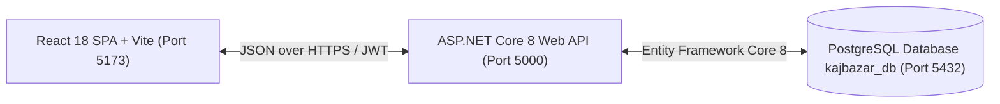

# 🛠️ KajBazar: A Community-Driven Service Provider Directory Platform

[](https://dotnet.microsoft.com/)
[](https://react.dev/)
[](https://vitejs.dev/)
[](https://www.postgresql.org/)
[](tests/KajBazar.Tests/)
[](docs/KajBazar_Project_Proposal_Formatted.md)

**KajBazar** is an enterprise-grade, community-driven digital service provider directory platform designed to connect consumers directly with verified local skilled workers (electricians, plumbers, carpenters, mechanics, painters, etc.) across Bangladesh.

Unlike traditional service marketplaces that enforce heavy commission cuts or act as strict booking middlemen, KajBazar empowers local tradespeople by functioning as a high-trust directory:
- Consumers search for professionals by location (District & Upazila) and trade category.
- Consumers view verified credentials, ratings, and experience.
- Consumers directly contact workers via phone without platform cuts or booking fees (`BR-06`).
- Community members can recommend skilled offline tradespeople who do not own smartphones (`BR-09`).
- Consumers maintain accountability through transparent ratings and reviews (`BR-07`, `BR-08`).

---

## 📌 Key System Features & Business Rules

- 🔍 **Location & Category Search (`BR-05`)**: Multi-criteria directory filter by Category, District, Upazila, and keyword.
- ✅ **Verified Worker Profiles (`BR-02`, `BR-03`)**: Only administrator-verified service providers are visible in the public directory.
- 📞 **Direct Contact System (`BR-06`)**: Direct phone communication between consumers and workers without platform fees.
- ⭐ **Real-Time Ratings & Reviews (`BR-07`, `BR-08`)**: Automated PostgreSQL trigger functions calculate average rating and review counts in real time. Single review per consumer enforced.
- 🤝 **Community Recommendations (`BR-09`)**: Community referral system for offline workers, reviewed and onboarded by admins.
- 🛡️ **Administrative Moderation & Audit Logging (`BR-10` to `BR-14`)**: Dedicated dashboard for worker verification, taxonomy management, and immutable audit trails.
- 🔒 **Security Hardening (`BR-15`)**: Salted BCrypt password encryption (cost factor 11), JWT Bearer tokens, and parameterized SQL queries.

---

## 🏗️ System Architecture



| Layer | Technology | Description |
| :--- | :--- | :--- |
| **Frontend** | React 18, Vite, React Router v6, Axios | Responsive Single Page Application with JWT authorization request interceptors and Context API global state |
| **Backend API** | ASP.NET Core 8 Web API | Clean Layered Architecture (Core, Infrastructure, API) with Dependency Injection and JWT Bearer RBAC |
| **ORM** | Entity Framework Core 8 | Object-Relational Mapping with PostgreSQL provider (`Npgsql`) and automatic snake_case naming |
| **Database** | PostgreSQL 15+ | 12 relational tables, B-Tree composite indexes, check constraints, UUIDs, and automated rating triggers |
| **Testing** | xUnit, In-Memory DbContext | 14 automated unit and integration tests covering authentication, search, reviews, and audit logs |

---

## 📁 Repository Structure

```
Kajbazar/
├── KajBazar.sln                  # Master .NET Solution
├── client/                       # React 18 Frontend Application (Vite)
│   ├── index.html                # Single Page Application HTML shell
│   ├── package.json              # NPM dependencies & scripts
│   ├── vite.config.js            # Vite build configuration
│   └── src/
│       ├── components/           # Navigation, WorkerCard, WorkerFilter, DetailModal
│       ├── context/              # AuthContext session state & JWT persistence
│       ├── pages/                # Home, Directory, Profile, Recommend, Admin, Auth
│       ├── services/             # Axios API client with automatic Bearer headers
│       └── styles/               # Responsive modern CSS design system (App.css)
├── src/                          # ASP.NET Core 8 Backend Server
│   ├── KajBazar.Core/            # Domain Entities, DTOs, Repository Interfaces
│   ├── KajBazar.Infrastructure/  # EF Core DbContext, Repositories, AuthService
│   └── KajBazar.API/             # Controllers, Exception Middleware, Program.cs
├── sql/                          # Production PostgreSQL Engine Scripts
│   ├── 01_schema_ddl.sql         # 12 Tables, constraints, triggers, indexes
│   ├── 02_seed_data.sql          # Seed roles, districts, upazilas, categories, verified workers
│   ├── 03_crud_queries.sql       # Tested CRUD queries
│   └── 04_complex_queries.sql    # Analytical reporting and ranking queries
├── tests/                        # Automated xUnit Test Suite
│   └── KajBazar.Tests/           # 14 passing automated tests
└── docs/                         # Technical Documentation & System Diagrams
    ├── diagrams/                 # 15 Mermaid system architecture diagrams (.mmd)
    └── development-guide/        # 10 comprehensive volumes (The "Dumb Person" Master Guide)
```

---

## 🚀 Quick Start Guide

### 1. Database Setup (PostgreSQL)

```bash
# Create database
psql -U postgres -c "CREATE DATABASE kajbazar_db;"

# Execute DDL schema script (12 tables, constraints, triggers, indexes)
psql -U postgres -d kajbazar_db -f sql/01_schema_ddl.sql

# Execute Seed Data script (districts, upazilas, categories, verified test accounts)
psql -U postgres -d kajbazar_db -f sql/02_seed_data.sql
```

### 2. Backend Execution (.NET 8 Web API)

```bash
cd src/KajBazar.API
dotnet restore
dotnet run
```
- API listening on: `http://localhost:5000`
- Interactive Swagger API Explorer: `http://localhost:5000/swagger`

### 3. Frontend Execution (React + Vite)

```bash
cd client
npm install
npm run dev
```
- Frontend listening on: `http://localhost:5173`

### 4. Running Automated Tests

```bash
dotnet test KajBazar.sln
```
*Result: 14 Passed, 0 Failed, 0 Skipped (duration: ~300ms)*

---

## 📚 Comprehensive Documentation & Guides

All technical documentation is organized in `docs/`:

### 🎨 System Diagrams (`docs/diagrams/`)
All 15 system diagrams are maintained in Mermaid syntax in [`docs/diagrams/`](docs/diagrams/):
1. [`01_context_diagram.mmd`](docs/diagrams/01_context_diagram.mmd) - High-level system boundary
2. [`02_dfd_level_0.mmd`](docs/diagrams/02_dfd_level_0.mmd) - Context level data flow
3. [`03_dfd_level_1.mmd`](docs/diagrams/03_dfd_level_1.mmd) - Subsystem process decomposition
4. [`04_dfd_level_2.mmd`](docs/diagrams/04_dfd_level_2.mmd) - Worker verification decomposition
5. [`05_use_case_diagram.mmd`](docs/diagrams/05_use_case_diagram.mmd) - Actor interactions
6. [`06_activity_diagram_registration.mmd`](docs/diagrams/06_activity_diagram_registration.mmd) - User registration workflow
7. [`07_activity_diagram_worker_verification.mmd`](docs/diagrams/07_activity_diagram_worker_verification.mmd) - Admin verification workflow
8. [`08_activity_diagram_search_and_contact.mmd`](docs/diagrams/08_activity_diagram_search_and_contact.mmd) - Consumer search & contact workflow
9. [`09_activity_diagram_review_submission.mmd`](docs/diagrams/09_activity_diagram_review_submission.mmd) - Review & rating recalculation
10. [`10_activity_diagram_recommendation.mmd`](docs/diagrams/10_activity_diagram_recommendation.mmd) - Offline worker nomination
11. [`11_class_diagram_domain_model.mmd`](docs/diagrams/11_class_diagram_domain_model.mmd) - C# domain entities
12. [`12_class_diagram_architecture.mmd`](docs/diagrams/12_class_diagram_architecture.mmd) - Clean Architecture layers
13. [`13_er_diagram_conceptual.mmd`](docs/diagrams/13_er_diagram_conceptual.mmd) - Conceptual entities
14. [`14_er_diagram_physical.mmd`](docs/diagrams/14_er_diagram_physical.mmd) - Physical 12-table PostgreSQL schema
15. [`15_sequence_diagrams.mmd`](docs/diagrams/15_sequence_diagrams.mmd) - Detailed sequence interactions

### 📖 Master Developer Guide (`docs/development-guide/`)
The 10-Volume handbook explaining every detail step-by-step ("for a beginner / dumb person"):
- [Volume 00: Master Overview & Table of Contents](docs/development-guide/00-master-overview-and-table-of-contents.md)
- [Volume 01: Complete Architecture & Build From Scratch Guide](docs/development-guide/01-complete-architecture-and-build-from-scratch.md)
- [Volume 02: Database Guide & Production Hardening](docs/development-guide/02-database-guide-and-production-hardening.md)
- [Volume 03: Backend ASP.NET Core 8 Developer Guide](docs/development-guide/03-backend-aspnet-core-developer-guide.md)
- [Volume 04: Frontend React.js & Vite Developer Guide](docs/development-guide/04-frontend-react-developer-guide.md)
- [Volume 05: Testing Guide & Test Suites](docs/development-guide/05-testing-guide-and-test-suites.md)
- [Volume 06: Production Deployment & DevOps Guide](docs/development-guide/06-deployment-and-devops-guide.md)
- [Volume 07: Troubleshooting & FAQ Guide](docs/development-guide/07-troubleshooting-and-faq-guide.md)
- [Volume 08: Maintenance & Evolution Guide](docs/development-guide/08-maintenance-and-evolution-guide.md)
- [Volume 09: Security & Incident Response Guide](docs/development-guide/09-security-and-incident-response-guide.md)
- [Volume 10: Performance Optimization & Scaling Guide](docs/development-guide/10-performance-optimization-and-scaling-guide.md)

---

## 🎓 Academic Metadata & Credits

- **Course Title**: System Analysis and Design Sessional
- **Course Code**: CIT - 222
- **Session**: 2023-2024
- **Institution**: Faculty of Computer Science and Engineering, Patuakhali Science and Technology University (PSTU)

### Project Team
| Name | Student ID |
| :--- | :---: |
| **Md Leon Islam** | 2302008 |
| **Tanvir Ishrak** | 2302049 |
| **S M Arifuzzaman** | 2302054 |
| **Asif Md. Iqbal Sourav** | 2302067 |

### Course Instructors
- **Prof. Golam Md. Muradul Bashir**, Professor, Dept. of CCE, PSTU
- **Muhtasim**, Lecturer, Dept. of CSIT, PSTU
