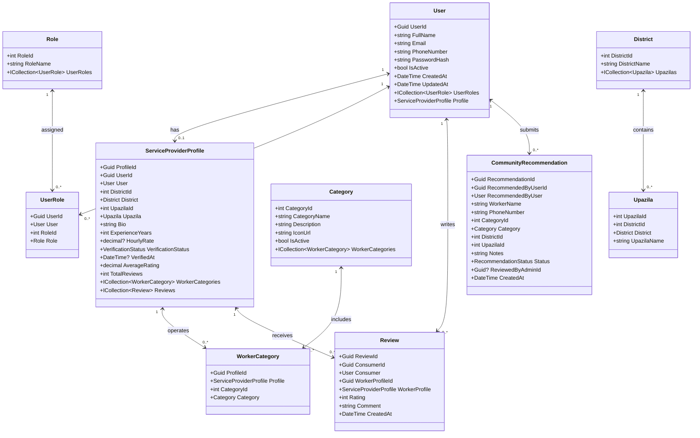

# KajBazar - Class Diagrams

This document contains UML Class Diagrams for **KajBazar**, illustrating domain entities, service interfaces, repository abstractions, and API controllers.

---

## 1. Domain Model Class Diagram

---

## 2. API Controllers & Repository Architecture Diagram

```mermaid
classDiagram
    class AuthController {
        -IUserRepository _userRepository
        -IJwtService _jwtService
        +Register(RegisterDto dto) Task~IActionResult~
        +Login(LoginDto dto) Task~IActionResult~
    }

    class WorkersController {
        -IServiceProviderRepository _workerRepository
        +SearchWorkers(WorkerSearchFilterDto filter) Task~IActionResult~
        +GetWorkerById(Guid id) Task~IActionResult~
        +UpdateProfile(Guid id, UpdateProfileDto dto) Task~IActionResult~
    }

    class ReviewsController {
        -IReviewRepository _reviewRepository
        +AddReview(CreateReviewDto dto) Task~IActionResult~
        +GetWorkerReviews(Guid workerProfileId) Task~IActionResult~
    }

    class AdminController {
        -IServiceProviderRepository _workerRepository
        -IRecommendationRepository _recommendationRepository
        +ApproveWorker(Guid profileId) Task~IActionResult~
        +RejectWorker(Guid profileId, string reason) Task~IActionResult~
        +ApproveRecommendation(Guid recommendationId) Task~IActionResult~
    }

    class IUserRepository {
        <<interface>>
        +GetByIdAsync(Guid id) Task~User~
        +GetByEmailAsync(string email) Task~User~
        +AddAsync(User user) Task
    }

    class IServiceProviderRepository {
        <<interface>>
        +SearchAsync(WorkerSearchFilter filter) Task~IEnumerable~ServiceProviderProfile~~
        +GetByIdAsync(Guid id) Task~ServiceProviderProfile~
        +UpdateVerificationStatusAsync(Guid id, VerificationStatus status) Task
    }

    class IReviewRepository {
        <<interface>>
        +AddReviewAsync(Review review) Task
        +GetByWorkerProfileIdAsync(Guid profileId) Task~IEnumerable~Review~~
        +ExistsAsync(Guid consumerId, Guid workerProfileId) Task~bool~
    }

    AuthController --> IUserRepository
    WorkersController --> IServiceProviderRepository
    ReviewsController --> IReviewRepository
    AdminController --> IServiceProviderRepository
```

