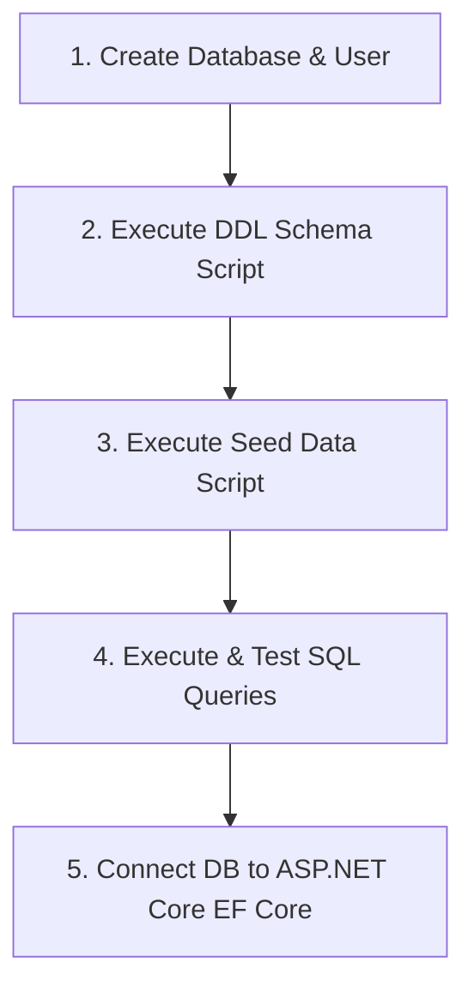

# KajBazar - Database Setup, Query Testing, and ASP.NET Core Integration Guide

This document provides a step-by-step guide for creating the **PostgreSQL** database, executing DDL table creation scripts, running seed data, executing operational and complex SQL queries, and configuring connection parameters in the **ASP.NET Core (.NET 8)** backend project.

---

## 🛠️ Prerequisites & PostgreSQL Installation

Ensure PostgreSQL Server (v15 or higher) is installed on your system.

- **Linux (Ubuntu/Debian)**:
  ```bash
  sudo apt update
  sudo apt install postgresql postgresql-contrib
  sudo systemctl start postgresql
  ```
- **Windows / macOS**: Download installer from [postgresql.org/download](https://www.postgresql.org/download/).

---

## 🗺️ Database Lifecycle Workflow



---

## Step 1: Database Creation & Extensions

1. **Access PostgreSQL Terminal (`psql`)**:
   ```bash
   sudo -u postgres psql
   ```

2. **Create Database User & Assign Password**:

   ```sql
   CREATE USER kajadmin WITH PASSWORD 'KajBazarPass123#';
   ```
> **Note:** This is just an example. Use a different _username_, strong and secure _password_ in production environments.

1. **Create Database**:
   ```sql
   CREATE DATABASE kajbazar_db WITH OWNER = kajadmin;
   GRANT ALL PRIVILEGES ON DATABASE kajbazar_db TO kajadmin;
   ```

2. **Connect to `kajbazar_db` and Enable UUID Extension**:
   ```sql
   \c kajbazar_db
   CREATE EXTENSION IF NOT EXISTS "uuid-ossp";
   ```

---

## Step 2: Table Creation (Executing DDL Schema)

The database schema consists of **12 relational tables** defined in [`sql/01_schema_ddl.sql`](file:///home/noir/Desktop/4th/Project/sql/01_schema_ddl.sql).

### 2.1 Execute DDL Script
```bash
psql -U kajadmin -d kajbazar_db -f sql/01_schema_ddl.sql
```

### 2.2 Table Creation Breakdown

| Table Name | Primary Key | Key Foreign Keys & Constraints | Business Rule Enforced |
| :--- | :--- | :--- | :--- |
| `roles` | `role_id` (INT) | `UNIQUE(role_name)` | System access roles (`Admin`, `Consumer`, `ServiceProvider`) |
| `users` | `user_id` (UUID) | `UNIQUE(email)`, `UNIQUE(phone_number)` | User credentials & authentication (`BR-01`, `BR-13`, `BR-15`) |
| `user_roles` | `(user_id, role_id)` | FKs to `users`, `roles` (`ON DELETE CASCADE`) | Role-based access control mapping |
| `districts` | `district_id` (INT) | `UNIQUE(district_name)` | Regional district geography |
| `upazilas` | `upazila_id` (INT) | FK to `districts` | Regional sub-district geography (`BR-05`) |
| `categories` | `category_id` (INT) | `UNIQUE(category_name)` | Service categories (`BR-04`, `BR-11`) |
| `service_provider_profiles` | `profile_id` (UUID) | FKs to `users`, `districts`, `upazilas`; `CHECK(verification_status)` | Worker profile & verification status (`BR-02`, `BR-03`) |
| `worker_categories` | `(profile_id, category_id)` | FKs to `service_provider_profiles`, `categories` | Multi-category worker mapping (`BR-04`) |
| `reviews` | `review_id` (UUID) | `CHECK(rating BETWEEN 1 AND 5)`, `UNIQUE(consumer_id, worker_profile_id)` | Ratings & 1-review per worker limit (`BR-07`, `BR-08`) |
| `community_recommendations` | `recommendation_id` (UUID) | FKs to `users`, `categories`, `districts`, `upazilas` | Offline worker referrals (`BR-09`) |
| `reports` | `report_id` (UUID) | FKs to `users` | Moderation content reports (`BR-12`) |
| `admin_audit_logs` | `log_id` (UUID) | FK to `users` | Administrative action audit log (`BR-14`) |

---

## Step 3: Data Seeding

Populate default roles, regional Bangladesh locations, service categories, and test accounts defined in [`sql/02_seed_data.sql`](file:///home/noir/Desktop/4th/Project/sql/02_seed_data.sql).

### 3.1 Execute Seed Script
```bash
psql -U kajadmin -d kajbazar_db -f sql/02_seed_data.sql
```

### 3.2 Verify Populated Records
Run standard verification SELECT queries:
```sql
SELECT * FROM roles;
SELECT * FROM categories;
SELECT d.district_name, u.upazila_name FROM upazilas u JOIN districts d ON u.district_id = d.district_id;
SELECT user_id, full_name, email FROM users;
```

---

## Step 4: Executing & Testing Database Queries

### 4.1 Operational CRUD Testing
Run queries in [`sql/03_crud_queries.sql`](file:///home/noir/Desktop/4th/Project/sql/03_crud_queries.sql):

1. **User Authentication Lookup (`BR-01`)**:
   ```sql
   SELECT u.user_id, u.full_name, u.email, u.password_hash, r.role_name
   FROM users u
   JOIN user_roles ur ON u.user_id = ur.user_id
   JOIN roles r ON ur.role_id = r.role_id
   WHERE u.email = 'karim@gmail.com' AND u.is_active = TRUE;
   ```

2. **Review Submission & Rating Aggregate Recalculation (`BR-07`, `BR-08`)**:
   ```sql
   -- Insert or Update Review
   INSERT INTO reviews (consumer_id, worker_profile_id, rating, comment)
   VALUES ('b0000000-0000-0000-0000-000000000001', 'd0000000-0000-0000-0000-000000000001', 5, 'Great work!')
   ON CONFLICT (consumer_id, worker_profile_id) 
   DO UPDATE SET rating = EXCLUDED.rating, comment = EXCLUDED.comment;

   -- Recalculate Worker Average Score
   WITH stats AS (
       SELECT COUNT(*) AS cnt, ROUND(AVG(rating)::numeric, 2) AS score
       FROM reviews WHERE worker_profile_id = 'd0000000-0000-0000-0000-000000000001'
   )
   UPDATE service_provider_profiles
   SET total_reviews = stats.cnt, average_rating = stats.score FROM stats
   WHERE profile_id = 'd0000000-0000-0000-0000-000000000001';
   ```

---

### 4.2 Complex Analytical Query Testing
Run advanced queries in [`sql/04_complex_queries.sql`](file:///home/noir/Desktop/4th/Project/sql/04_complex_queries.sql):

1. **Multi-Criteria Location & Category Worker Search (`BR-03`, `BR-05`)**:
   ```sql
   SELECT 
       p.profile_id, u.full_name AS worker_name, u.phone_number,
       d.district_name, uz.upazila_name, p.experience_years, p.hourly_rate,
       p.average_rating, p.total_reviews, STRING_AGG(c.category_name, ', ') AS categories
   FROM service_provider_profiles p
   JOIN users u ON p.user_id = u.user_id
   JOIN districts d ON p.district_id = d.district_id
   JOIN upazilas uz ON p.upazila_id = uz.upazila_id
   JOIN worker_categories wc ON p.profile_id = wc.profile_id
   JOIN categories c ON wc.category_id = c.category_id
   WHERE p.verification_status = 'VERIFIED'
     AND d.district_name = 'Patuakhali'
     AND uz.upazila_name = 'Dumki'
     AND p.average_rating >= 4.00
   GROUP BY p.profile_id, u.full_name, u.phone_number, d.district_name, uz.upazila_name, p.experience_years, p.hourly_rate, p.average_rating, p.total_reviews
   ORDER BY p.average_rating DESC, p.total_reviews DESC
   LIMIT 10 OFFSET 0;
   ```

2. **Top-Rated Worker Rankings Per District & Category (`DENSE_RANK`)**:
   ```sql
   WITH ranked_workers AS (
       SELECT 
           d.district_name, c.category_name, u.full_name AS worker_name,
           p.average_rating, p.total_reviews,
           DENSE_RANK() OVER (
               PARTITION BY d.district_id, c.category_id 
               ORDER BY p.average_rating DESC, p.total_reviews DESC
           ) AS rank_num
       FROM service_provider_profiles p
       JOIN users u ON p.user_id = u.user_id
       JOIN districts d ON p.district_id = d.district_id
       JOIN worker_categories wc ON p.profile_id = wc.profile_id
       JOIN categories c ON wc.category_id = c.category_id
       WHERE p.verification_status = 'VERIFIED'
   )
   SELECT * FROM ranked_workers WHERE rank_num <= 3;
   ```

---

## Step 5: Connecting Database with ASP.NET Core Project

### 5.1 Add EF Core PostgreSQL NuGet Package
In the project directory `src/KajBazar.Infrastructure`:
```bash
dotnet add package Npgsql.EntityFrameworkCore.PostgreSQL
```

### 5.2 Configure Connection String (`appsettings.json`)
Update [`src/KajBazar.API/appsettings.json`](file:///home/noir/Desktop/4th/Project/src/KajBazar.API/Controllers/AuthController.cs):
```json
{
  "ConnectionStrings": {
    "DefaultConnection": "Host=localhost;Port=5432;Database=kajbazar_db;Username=kajadmin;Password=KajBazarPass123#"
  }
}
```

### 5.3 Register DbContext in ASP.NET Core (`Program.cs`)
In `src/KajBazar.API/Program.cs`:
```csharp
using Microsoft.EntityFrameworkCore;
using KajBazar.Infrastructure.Data;

var builder = WebApplication.CreateBuilder(args);

// Register PostgreSQL EF Core DbContext
builder.Services.AddDbContext<KajBazarDbContext>(options =>
    options.UseNpgsql(builder.Configuration.GetConnectionString("DefaultConnection")));

var app = builder.Build();
```

### 5.4 Execute EF Core Migrations (Optional alternative to SQL DDL)
If managing database schema via EF Core Code-First migrations:
```bash
# Create initial migration
dotnet ef migrations add InitialCreate --project src/KajBazar.Infrastructure --startup-project src/KajBazar.API

# Update database schema
dotnet ef database update --project src/KajBazar.Infrastructure --startup-project src/KajBazar.API
```

### 5.5 Test Database Connection from ASP.NET Core API
Start ASP.NET Core Web API:
```bash
cd src/KajBazar.API
dotnet run
```
Navigate to `http://localhost:5000/api/workers/search`. If the connection is configured properly, PostgreSQL returns data populated from the seed script.
