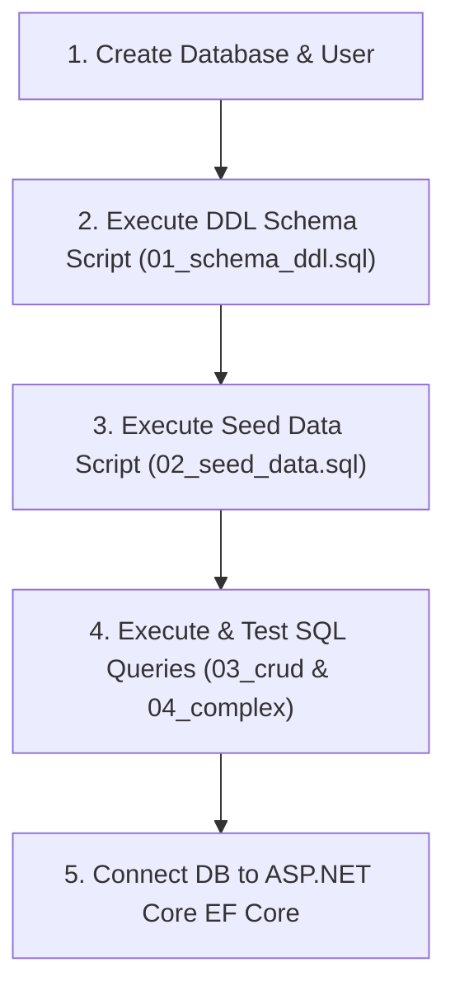

# KajBazar - Database Setup, Query Testing, and ASP.NET Core Integration Guide

This document provides a step-by-step guide for creating the **PostgreSQL** database, executing DDL table creation scripts, running seed data, executing operational and complex SQL queries, and configuring connection parameters in the **ASP.NET Core (.NET 8)** backend project.

---

## 🛠️ Prerequisites & PostgreSQL Installation

Ensure PostgreSQL Server (v15 or higher) is installed and active on your system.

- **Linux (Ubuntu/Debian)**:
  ```bash
  sudo apt update
  sudo apt install -y postgresql postgresql-contrib
  sudo systemctl enable postgresql
  sudo systemctl start postgresql
  ```
- **macOS**: `brew install postgresql@15 && brew services start postgresql@15`
- **Windows**: Download installer from [postgresql.org/download](https://www.postgresql.org/download/).

---

## 🗺️ Database Lifecycle Workflow


```mermaid
flowchart TD
    D1["1. Create Database & User"] --> D2["2. Execute DDL Schema Script (01_schema_ddl.sql)"]
    D2 --> D3["3. Execute Seed Data Script (02_seed_data.sql)"]
    D3 --> D4["4. Execute & Test SQL Queries (03_crud & 04_complex)"]
    D4 --> D5["5. Connect DB to ASP.NET Core EF Core"]
```

---

## Step 1: Database Creation & Extensions

1. **Access PostgreSQL Terminal (`psql`)**:
   ```bash
   sudo -u postgres psql
   ```

2. **Create Database**:
   ```sql
   CREATE DATABASE kajbazar_db;
   ```

3. **Verify Database Creation**:
   ```sql
   \l
   \q
   ```

---

## Step 2: Table Creation (Executing DDL Schema)

The database schema consists of **12 relational tables** defined in [`sql/01_schema_ddl.sql`](file:///home/noir/Desktop/PROJECTS/Kajbazar/sql/01_schema_ddl.sql).

### 2.1 Execute DDL Script
```bash
psql -U postgres -d kajbazar_db -f sql/01_schema_ddl.sql
```

### 2.2 Table Creation Breakdown

| Table Name | Primary Key | Key Foreign Keys & Constraints | Business Rule Enforced |
| :--- | :--- | :--- | :--- |
| `roles` | `role_id` (INT) | `UNIQUE(role_name)` | System access roles (`Admin`, `ServiceProvider`, `Consumer`) |
| `users` | `user_id` (UUID) | `UNIQUE(email)`, `UNIQUE(phone_number)` | User credentials & authentication (`BR-01`, `BR-13`, `BR-15`) |
| `user_roles` | `(user_id, role_id)` | FKs to `users`, `roles` (`ON DELETE CASCADE`) | Role-based access control mapping (`BR-13`) |
| `districts` | `district_id` (INT) | `UNIQUE(district_name)` | Regional district geography |
| `upazilas` | `upazila_id` (INT) | FK to `districts` (`ON DELETE CASCADE`); `UNIQUE(district_id, upazila_name)` | Regional sub-district geography (`BR-05`) |
| `categories` | `category_id` (INT) | `UNIQUE(category_name)` | Service categories (`BR-04`, `BR-11`) |
| `service_provider_profiles` | `profile_id` (UUID) | FKs to `users`, `districts`, `upazilas`; `CHECK(verification_status)` | Worker profile & verification status (`BR-02`, `BR-03`) |
| `worker_categories` | `(profile_id, category_id)` | FKs to `service_provider_profiles`, `categories` | Multi-category worker mapping (`BR-04`) |
| `reviews` | `review_id` (UUID) | `CHECK(rating BETWEEN 1 AND 5)`, `UNIQUE(consumer_id, worker_profile_id)` | Ratings & 1-review per worker limit (`BR-07`, `BR-08`) |
| `community_recommendations` | `recommendation_id` (UUID) | FKs to `users`, `categories`, `districts`, `upazilas` | Offline worker referrals (`BR-09`) |
| `reports` | `report_id` (UUID) | FK to `users` | Moderation content reports (`BR-12`) |
| `admin_audit_logs` | `log_id` (UUID) | FK to `users` | Administrative action audit log (`BR-14`) |

---

## Step 3: Data Seeding

Populate default roles, regional Bangladesh locations, service categories, and verified test accounts defined in [`sql/02_seed_data.sql`](file:///home/noir/Desktop/PROJECTS/Kajbazar/sql/02_seed_data.sql).

### 3.1 Execute Seed Script
```bash
psql -U postgres -d kajbazar_db -f sql/02_seed_data.sql
```

### 3.2 Verify Populated Records
Run standard verification SELECT queries:
```sql
SELECT category_name FROM categories;
SELECT district_name FROM districts;
SELECT u.full_name, r.role_name, sp.verification_status, sp.average_rating
FROM users u
JOIN user_roles ur ON u.user_id = ur.user_id
JOIN roles r ON ur.role_id = r.role_id
LEFT JOIN service_provider_profiles sp ON u.user_id = sp.user_id;
```

---

## Step 4: Query Testing

### 4.1 Execute CRUD Queries
Verify data manipulation queries in [`sql/03_crud_queries.sql`](file:///home/noir/Desktop/PROJECTS/Kajbazar/sql/03_crud_queries.sql):
```bash
psql -U postgres -d kajbazar_db -f sql/03_crud_queries.sql
```

### 4.2 Execute Complex Analytical Queries
Verify reporting and directory search queries in [`sql/04_complex_queries.sql`](file:///home/noir/Desktop/PROJECTS/Kajbazar/sql/04_complex_queries.sql):
```bash
psql -U postgres -d kajbazar_db -f sql/04_complex_queries.sql
```

---

## Step 5: ASP.NET Core EF Core Integration

### 5.1 Connection String Configuration
In [`src/KajBazar.API/appsettings.json`](file:///home/noir/Desktop/PROJECTS/Kajbazar/src/KajBazar.API/appsettings.json):
```json
{
  "ConnectionStrings": {
    "DefaultConnection": "Host=localhost;Port=5432;Database=kajbazar_db;Username=postgres;Password=;"
  },
  "JwtSettings": {
    "SecretKey": "KajBazarSuperSecretKeyWhichIsAtLeast256BitsLongForSecurity#123",
    "Issuer": "KajBazarAPI",
    "Audience": "KajBazarApp",
    "ExpiryInMinutes": 1440
  }
}
```

### 5.2 EF Core DbContext Registration
In [`src/KajBazar.API/Program.cs`](file:///home/noir/Desktop/PROJECTS/Kajbazar/src/KajBazar.API/Program.cs):
```csharp
builder.Services.AddDbContext<KajBazarDbContext>(options =>
    options.UseNpgsql(builder.Configuration.GetConnectionString("DefaultConnection"))
           .UseSnakeCaseNamingConvention());
```

### 5.3 Test Running the Backend
```bash
cd src/KajBazar.API
dotnet run
```
Verify endpoint: `curl -s http://localhost:5000/api/categories | jq`
