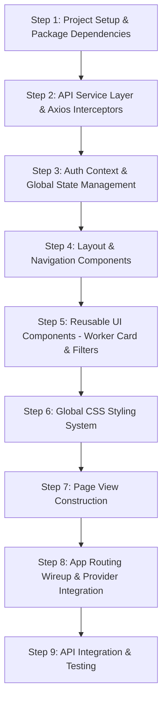

# KajBazar - Frontend Development & Step-by-Step Construction Guide

This document provides a detailed, step-by-step roadmap for constructing the **KajBazar React.js Frontend** application. It specifies the precise sequence of implementation ("which part after which part"), component design patterns, routing architecture, state management, and API integration.

---

## 🏗️ Frontend Technology Stack

- **Framework**: React.js (v18+)
- **Routing**: React Router DOM (v6+)
- **HTTP Client**: Axios (v1.6+) with JWT Authorization Interceptor
- **State Management**: React Context API (`AuthContext`)
- **Styling**: CSS3 (CSS Variables, Flexbox, Responsive Grid)

---

## 🗺️ Sequential Execution Flow ("Which Part After Which Part")



---

## 📖 Detailed Step-by-Step Implementation Guide

### Step 1: Project Initialization & Dependency Setup
**Goal**: Establish client directory structure, package manifest, and entry HTML setup.

1. **Initialize Folder Structure**:
   ```
   client/
   ├── package.json
   ├── public/
   │   └── index.html
   └── src/
       ├── components/
       ├── context/
       ├── pages/
       ├── services/
       └── styles/
   ```

2. **Configure `package.json`**:
   - Dependencies: `react`, `react-dom`, `react-router-dom`, `axios`.

3. **Create Entry Script [`src/index.js`](file:///home/noir/Desktop/4th/Project/client/src/index.js)**:
   - Mount React root and import global stylesheet.

---

### Step 2: API Service & HTTP Client Layer
**Goal**: Create a centralized HTTP client wrapper handling API base URLs and automatic JWT Bearer token attachment.

- **File**: [`src/services/api.js`](file:///home/noir/Desktop/4th/Project/client/src/services/api.js)
- **Key Tasks**:
  1. Instantiate Axios instance with `REACT_APP_API_URL` base URL.
  2. Implement Request Interceptor to pull JWT from `localStorage` and inject `Authorization: Bearer <token>` into outgoing requests.
  3. Export API endpoint functions: `searchWorkers()`, `getWorkerProfile()`, `submitReview()`, `recommendOfflineWorker()`.

---

### Step 3: Global Authentication Context Layer
**Goal**: Manage user session state, JWT storage, login/logout actions, and role-based permissions (`Consumer`, `ServiceProvider`, `Admin`).

- **File**: [`src/context/AuthContext.js`](file:///home/noir/Desktop/4th/Project/client/src/context/AuthContext.js)
- **Key Tasks**:
  1. Create `AuthContext` with default state (`user`, `token`, `isAuthenticated`).
  2. Implement `login(userData, jwtToken)` to persist user object and token to `localStorage`.
  3. Implement `logout()` to flush session and navigate user to homepage.
  4. Wrap application in `AuthProvider`.

---

### Step 4: Core Navigation & Layout Components
**Goal**: Build persistent header navigation bar and footer layout.

- **File**: [`src/components/Navigation.jsx`](file:///home/noir/Desktop/4th/Project/client/src/components/Navigation.jsx)
- **Key Tasks**:
  1. `Navbar`: Display logo, directory links, and role-conditional actions:
     - Show **Admin Dashboard** link if `user.role === 'Admin'`.
     - Show **Login** / **Register** buttons for unauthenticated visitors.
     - Show **User Greeting** & **Logout** button for logged-in users.
  2. `Footer`: Display copyright, platform mission statement, and university metadata.

---

### Step 5: Reusable UI & Directory Filtering Components
**Goal**: Build reusable components for worker directory listings and multi-criteria search.

- **File**: [`src/components/WorkerComponents.jsx`](file:///home/noir/Desktop/4th/Project/client/src/components/WorkerComponents.jsx)
- **Key Tasks**:
  1. `WorkerCard`:
     - Render worker name, average rating badge (⭐), category tags, experience years, hourly rate, and location (Upazila, District).
     - Implement "Contact Worker" button that toggles and displays worker phone number (`tel:017xxxxxxx`) for direct communication (`BR-06`).
  2. `WorkerFilter`:
     - Render search input field for category query.
     - Render location select dropdowns for District and Upazila (`BR-05`).
     - Render Minimum Rating filter (4.0+ Stars, 4.5+ Stars).

---

### Step 6: Global CSS Styling System
**Goal**: Apply clean visual design, typography, responsive grids, and CSS variables.

- **File**: [`src/styles/App.css`](file:///home/noir/Desktop/4th/Project/client/src/styles/App.css)
- **Key Tasks**:
  1. Define `:root` color palette (`--primary-color`, `--secondary-color`, `--accent-color`, `--bg-color`).
  2. Style flexbox navigation bar and footer sticky layout (`min-height: 100vh`).
  3. Style grid containers for worker directory cards (`grid-template-columns: repeat(auto-fill, minmax(300px, 1fr))`).
  4. Style metrics boxes and data tables for Admin Dashboard.

---

### Step 7: Application Views & Page Components
**Goal**: Construct dedicated view pages for user interactions.

1. **[`src/pages/HomePage.jsx`](file:///home/noir/Desktop/4th/Project/client/src/pages/HomePage.jsx)**:
   - Hero banner introducing platform value proposition.
   - Primary Call to Action (CTA) buttons: "Find a Service Provider" & "Recommend Offline Worker".
   - Highlight cards for Location Filtering, Direct Contact, and Community Referral.

2. **[`src/pages/WorkerDirectoryPage.jsx`](file:///home/noir/Desktop/4th/Project/client/src/pages/WorkerDirectoryPage.jsx)**:
   - Render `WorkerFilter` control panel.
   - Fetch verified worker profiles from backend API (`BR-03`).
   - Render worker grid displaying matching `WorkerCard` components.

3. **[`src/pages/RecommendWorkerPage.jsx`](file:///home/noir/Desktop/4th/Project/client/src/pages/RecommendWorkerPage.jsx)**:
   - Render recommendation submission form (`BR-09`).
   - Capture worker name, phone number, category, district, upazila, and experience notes.
   - Display confirmation message upon submission.

4. **[`src/pages/AuthAndAdminPages.jsx`](file:///home/noir/Desktop/4th/Project/client/src/pages/AuthAndAdminPages.jsx)**:
   - `LoginPage`: Form for consumer, worker, or admin login.
   - `RegisterPage`: Registration form with role selector (`Consumer` vs `ServiceProvider`).
   - `AdminDashboardPage`: System metrics overview (Total Workers, Verified Workers, Pending Verifications, Pending Recommendations) and Worker Approval Moderation Table (`BR-03`, `BR-10`).

---

### Step 8: Application Routing & Provider Integration
**Goal**: Wire all components, pages, context providers, and routes into `App.jsx`.

- **File**: [`src/App.jsx`](file:///home/noir/Desktop/4th/Project/client/src/App.jsx)
- **Structure**:
  ```jsx
  <AuthProvider>
    <Router>
      <div className="app-layout">
        <Navbar />
        <main className="main-content">
          <Routes>
            <Route path="/" element={<HomePage />} />
            <Route path="/directory" element={<WorkerDirectoryPage />} />
            <Route path="/recommend" element={<RecommendWorkerPage />} />
            <Route path="/admin" element={<AdminDashboardPage />} />
            <Route path="/login" element={<LoginPage />} />
            <Route path="/register" element={<RegisterPage />} />
          </Routes>
        </main>
        <Footer />
      </div>
    </Router>
  </AuthProvider>
  ```

---

### Step 9: Integration, Verification & Deployment
**Goal**: Verify frontend functionality and connect with ASP.NET Core backend endpoints.

1. **Local Development Execution**:
   ```bash
   cd client
   npm install
   npm start
   ```
2. **Verification Checkpoints**:
   - Verify unverified worker profiles do not appear in search results (`BR-03`).
   - Verify direct contact button reveals phone number without payment barrier (`BR-06`).
   - Verify admin moderation table approves worker verification status.
