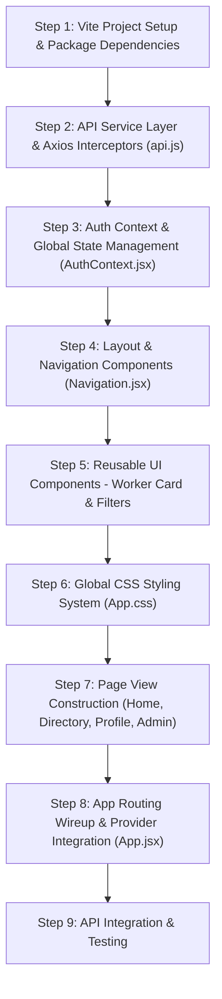

# KajBazar - Frontend Development & Step-by-Step Construction Guide

This document provides a detailed, step-by-step roadmap for constructing the **KajBazar React.js Frontend** application. It specifies the precise sequence of implementation ("which part after which part"), component design patterns, routing architecture, state management, and API integration.

---

## 🏗️ Frontend Technology Stack

- **Framework**: React.js 18 with modern Functional Components & Hooks
- **Bundler & Dev Server**: Vite (sub-second Hot Module Replacement)
- **Routing**: React Router DOM (v6)
- **HTTP Client**: Axios with JWT Authorization Request Interceptor
- **State Management**: React Context API (`AuthContext`)
- **Styling**: CSS3 (CSS Variables, Flexbox, Responsive Grid)

---

## 🗺️ Sequential Execution Flow ("Which Part After Which Part")


```mermaid
flowchart TD
    S1["Step 1: Vite Project Setup & Package Dependencies"] --> S2["Step 2: API Service Layer & Axios Interceptors (api.js)"]
    S2 --> S3["Step 3: Auth Context & Global State Management (AuthContext.jsx)"]
    S3 --> S4["Step 4: Layout & Navigation Components (Navigation.jsx)"]
    S4 --> S5["Step 5: Reusable UI Components - Worker Card & Filters"]
    S5 --> S6["Step 6: Global CSS Styling System (App.css)"]
    S6 --> S7["Step 7: Page View Construction (Home, Directory, Profile, Admin)"]
    S7 --> S8["Step 8: App Routing Wireup & Provider Integration (App.jsx)"]
    S8 --> S9["Step 9: API Integration & Testing"]
```

---

## 📖 Detailed Step-by-Step Implementation Guide

### Step 1: Project Initialization & Dependency Setup
**Goal**: Establish client directory structure, package manifest, and entry HTML setup using Vite.

1. **Initialize Folder Structure**:
   ```
   client/
   ├── index.html
   ├── package.json
   ├── vite.config.js
   └── src/
       ├── components/
       │   ├── Navigation.jsx
       │   └── WorkerComponents.jsx
       ├── context/
       │   └── AuthContext.jsx
       ├── pages/
       │   ├── HomePage.jsx
       │   ├── WorkerDirectoryPage.jsx
       │   ├── WorkerProfilePage.jsx
       │   ├── RecommendWorkerPage.jsx
       │   └── AuthAndAdminPages.jsx
       ├── services/
       │   └── api.js
       ├── styles/
       │   └── App.css
       ├── App.jsx
       └── index.jsx
   ```

2. **Configure `package.json`**:
   - Dependencies: `react`, `react-dom`, `react-router-dom`, `axios`.
   - Dev Dependencies: `@vitejs/plugin-react`, `vite`.

3. **Entry Scripts**:
   - [`index.html`](file:///home/noir/Desktop/PROJECTS/Kajbazar/client/index.html) mounts `<div id="root"></div>`.
   - [`src/index.jsx`](file:///home/noir/Desktop/PROJECTS/Kajbazar/client/src/index.jsx) boots React DOM with `createRoot`.

---

### Step 2: API Service & HTTP Client Layer
**Goal**: Create a centralized HTTP client wrapper handling API base URLs and automatic JWT Bearer token attachment.

- **File**: [`src/services/api.js`](file:///home/noir/Desktop/PROJECTS/Kajbazar/client/src/services/api.js)
- **Key Features**:
  1. Axios instance with `VITE_API_URL` or fallback `http://localhost:5000/api`.
  2. Request Interceptor: Pulls JWT from `localStorage` (`kajbazar_token`) and attaches `Authorization: Bearer <token>`.
  3. Response Interceptor: Catches 401 Unauthorized responses to flush expired tokens.
  4. Exports clean API methods: `api.get('/workers')`, `api.post('/reviews')`, `api.get('/categories')`, etc.

---

### Step 3: Global Authentication Context Layer
**Goal**: Manage user session state, JWT storage, login/logout actions, and role-based permissions (`Consumer`, `ServiceProvider`, `Admin`).

- **File**: [`src/context/AuthContext.jsx`](file:///home/noir/Desktop/PROJECTS/Kajbazar/client/src/context/AuthContext.jsx)
- **Key Features**:
  1. `AuthContext` provides `user`, `token`, `login()`, `logout()`, `isAuthenticated`.
  2. Restores session from `localStorage` on initial page load.
  3. Custom hook `useAuth()` allows any component to access session state.

---

### Step 4: Core Navigation & Layout Components
**Goal**: Build persistent header navigation bar and footer layout.

- **File**: [`src/components/Navigation.jsx`](file:///home/noir/Desktop/PROJECTS/Kajbazar/client/src/components/Navigation.jsx)
- **Key Features**:
  1. Navbar displaying logo, navigation links, and dynamic role buttons:
     - **Admin Dashboard** button shown only when `user.role === 'Admin'`.
     - **Login** / **Register** buttons for visitors.
     - **User Name** badge & **Logout** button for logged-in users.
  2. Responsive navigation toggle for mobile viewports.

---

### Step 5: Reusable UI & Directory Filtering Components
**Goal**: Build reusable components for worker directory listings and multi-criteria search.

- **File**: [`src/components/WorkerComponents.jsx`](file:///home/noir/Desktop/PROJECTS/Kajbazar/client/src/components/WorkerComponents.jsx)
- **Components**:
  1. `WorkerCard`: Profile card with name, trade badges, hourly rate, star rating, and direct phone number reveal button (`BR-06`).
  2. `WorkerFilter`: Cascading dropdowns (District $\rightarrow$ Upazilas), Category selector, and free-text search box (`BR-05`).
  3. `WorkerDetailModal`: Full profile modal showing experience, NID verification status, past customer reviews, and review submission form (`BR-07`, `BR-08`).

---

### Step 6: Global CSS Styling System
**Goal**: Implement a clean, responsive, modern design system without heavy bloated CSS libraries.

- **File**: [`src/styles/App.css`](file:///home/noir/Desktop/PROJECTS/Kajbazar/client/src/styles/App.css)
- **Features**:
  - CSS Custom Properties (Theme variables for colors, typography, borders, shadows).
  - CSS Grid for automatic responsive card layouts (`repeat(auto-fill, minmax(320px, 1fr))`).
  - Mobile breakpoints for tablets and smartphones (`@media (max-width: 768px)`).

---

### Step 7: Page View Construction
**Goal**: Build the primary pages of the platform.

1. **`HomePage.jsx`**: Hero section with search shortcut, live database statistics counters (verified workers, districts, reviews), and top category grid.
2. **`WorkerDirectoryPage.jsx`**: Real-time worker directory with active filters and empty state messages.
3. **`WorkerProfilePage.jsx`**: Dedicated worker profile view with reviews and rating submission.
4. **`RecommendWorkerPage.jsx`**: Community referral submission form for offline workers (`BR-09`).
5. **`AuthAndAdminPages.jsx`**:
   - `LoginPage`: Email and password authentication form.
   - `RegisterPage`: Account registration with role selection (`Consumer` or `ServiceProvider`).
   - `AdminDashboardPage`: 5-tab control center (Stats, Pending Approvals, Offline Referrals, Taxonomy, Audit Trail).

---

### Step 8: App Routing Wireup & Provider Integration
**Goal**: Connect all pages to client-side routes in [`src/App.jsx`](file:///home/noir/Desktop/PROJECTS/Kajbazar/client/src/App.jsx) wrapped inside `<AuthProvider>` and `<BrowserRouter>`.

---

### Step 9: Running and Building the Frontend

```bash
cd client

# Install dependencies (only needed once)
npm install

# Run local development server
npm run dev

# Compile optimized production bundle
npm run build
```
The compiled output is saved to `client/dist/`.
