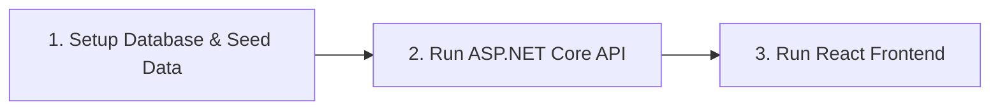

# KajBazar - Local Execution & Production Publishing Guide

This document provides complete, step-by-step instructions for running **KajBazar** locally in development, configuring environment variables, executing database migrations, and publishing the full stack (PostgreSQL, ASP.NET Core Web API, React Frontend) to production servers.

---

## 💻 1. Prerequisites & Required Tools

Before running or publishing the application, ensure the following runtimes and tools are installed:

| Component | Required Version | Download / Installation Link |
| :--- | :--- | :--- |
| **.NET SDK** | .NET 8.0 SDK | [dotnet.microsoft.com](https://dotnet.microsoft.com/download/dotnet/8.0) |
| **Node.js runtime** | Node.js v18 LTS or v20 LTS | [nodejs.org](https://nodejs.org/) |
| **PostgreSQL Database** | PostgreSQL v15 or higher | [postgresql.org](https://www.postgresql.org/download/) |
| **Git Version Control** | Git 2.40+ | [git-scm.com](https://git-scm.com/) |
| **Code Editor / IDE** | VS Code or Visual Studio 2022 | [code.visualstudio.com](https://code.visualstudio.com/) |

---

## 🚀 2. Local Execution Guide ("How to Run")

Follow these steps sequentially to get the application running on your local machine.



### Step 2.1: PostgreSQL Database Setup

1. **Start PostgreSQL Service** and connect using `psql` or pgAdmin:
   ```bash
   sudo service postgresql start
   ```

2. **Create Database**:
   ```sql
   CREATE DATABASE kajbazar_db;
   ```

3. **Run DDL Schema and Seed Scripts**:
   ```bash
   # Create database tables, constraints, and indexes
   psql -U postgres -d kajbazar_db -f sql/01_schema_ddl.sql

   # Populate roles, districts, upazilas, categories, and test users
   psql -U postgres -d kajbazar_db -f sql/02_seed_data.sql
   ```

---

### Step 2.2: Backend API Execution (ASP.NET Core .NET 8)

1. **Navigate to backend directory**:
   ```bash
   cd src/KajBazar.API
   ```

2. **Configure Environment Connection Settings (`appsettings.Development.json`)**:
   Create or update `appsettings.Development.json`:
   ```json
   {
     "ConnectionStrings": {
       "DefaultConnection": "Host=localhost;Port=5432;Database=kajbazar_db;Username=postgres;Password=YourPassword"
     },
     "JwtSettings": {
       "SecretKey": "KajBazarSuperSecretKeyWhichIsAtLeast256BitsLongForSecurity#123",
       "Issuer": "KajBazarAPI",
       "Audience": "KajBazarApp",
       "ExpiryInMinutes": 1440
     },
     "Logging": {
       "LogLevel": {
         "Default": "Information",
         "Microsoft.AspNetCore": "Warning"
       }
     }
   }
   ```

3. **Restore Packages & Run Web API**:
   ```bash
   # Restore dependencies
   dotnet restore

   # Build solution
   dotnet build

   # Run API server
   dotnet run
   ```

4. **Verify API Status**:
   Open browser and navigate to Swagger UI documentation at:
   `http://localhost:5000/swagger` or `https://localhost:5001/swagger`

---

### Step 2.3: Frontend Execution (React.js)

1. **Navigate to client directory**:
   ```bash
   cd client
   ```

2. **Install Node Dependencies**:
   ```bash
   npm install
   ```

3. **Configure Environment Variables (`client/.env.development`)**:
   ```env
   REACT_APP_API_URL=http://localhost:5000/api
   ```

4. **Start Development Server**:
   ```bash
   npm start
   ```

5. **Access Application**:
   Open browser and navigate to: `http://localhost:3000`

---

## 🌐 3. Production Publishing & Deployment Guide ("How to Publish")

### Step 3.1: Production PostgreSQL Database Setup

1. Provision a managed PostgreSQL instance (AWS RDS PostgreSQL, DigitalOcean Managed Database, or Ubuntu Server VM).
2. Apply DDL schema [`sql/01_schema_ddl.sql`](file:///home/noir/Desktop/4th/Project/sql/01_schema_ddl.sql) and seed data [`sql/02_seed_data.sql`](file:///home/noir/Desktop/4th/Project/sql/02_seed_data.sql).
3. Enable SSL connection enforcement and configure IP whitelisting for backend server access only.

---

### Step 3.2: Production ASP.NET Core Publishing (Linux / Nginx)

1. **Compile Optimized Release Binaries**:
   ```bash
   dotnet publish src/KajBazar.API/KajBazar.API.csproj -c Release -o ./publish
   ```

2. **Deploy to Production Linux Server (Ubuntu 22.04 LTS)**:
   Transfer `./publish` folder contents to production server at `/var/www/kajbazar-api`.

3. **Configure Systemd Service Unit (`/etc/systemd/system/kajbazar-api.service`)**:
   ```ini
   [Unit]
   Description=KajBazar Web API (.NET 8)
   After=network.target

   [Service]
   WorkingDirectory=/var/www/kajbazar-api
   ExecStart=/usr/bin/dotnet /var/www/kajbazar-api/KajBazar.API.dll
   Restart=always
   RestartSec=10
   KillSignal=SIGINT
   SyslogIdentifier=kajbazar-api
   User=www-data
   Environment=ASPNETCORE_ENVIRONMENT=Production
   Environment=ConnectionStrings__DefaultConnection="Host=prod-db-host;Database=kajbazar_db;Username=kajadmin;Password=STRONG_PASSWORD;SSL Mode=Require;"
   Environment=JwtSettings__SecretKey="PRODUCTION_256BIT_SECRET_KEY_NEVER_SHARE"

   [Install]
   WantedBy=multi-user.target
   ```

   Enable and start service:
   ```bash
   sudo systemctl enable kajbazar-api.service
   sudo systemctl start kajbazar-api.service
   ```

4. **Configure Nginx Reverse Proxy (`/etc/nginx/sites-available/kajbazar-api`)**:
   ```nginx
   server {
       listen 80;
       server_name api.kajbazar.com;

       location / {
           proxy_pass http://localhost:5000;
           proxy_http_version 1.1;
           proxy_set_header Upgrade $http_upgrade;
           proxy_set_header Connection keep-alive;
           proxy_set_header Host $host;
           proxy_cache_bypass $http_upgrade;
           proxy_set_header X-Forwarded-For $proxy_add_x_forwarded_for;
           proxy_set_header X-Forwarded-Proto $scheme;
       }
   }
   ```

5. **Enable HTTPS / SSL via Certbot**:
   ```bash
   sudo certbot --nginx -d api.kajbazar.com
   ```

---

### Step 3.3: Production React Frontend Publishing

1. **Configure Production Environment (`client/.env.production`)**:
   ```env
   REACT_APP_API_URL=https://api.kajbazar.com/api
   ```

2. **Generate Static Build Assets**:
   ```bash
   cd client
   npm run build
   ```
   This creates an optimized, minified `build/` directory.

3. **Deploy Options**:
   - **Option A (Nginx Server)**: Copy `build/` files to `/var/www/kajbazar-frontend` and serve static files with fallback to `index.html` for client-side routing.
   - **Option B (Firebase Hosting / Vercel)**:
     ```bash
     npx firebase-tools deploy
     ```

4. **Configure CORS in ASP.NET Core API**:
   Ensure `Program.cs` specifies:
   ```csharp
   builder.Services.AddCors(options =>
   {
       options.AddPolicy("AllowFrontend", policy =>
       {
           policy.WithOrigins("https://kajbazar.com")
                 .AllowAnyHeader()
                 .AllowAnyMethod();
       });
   });
   ```

---

## 🔄 4. Automated CI/CD Deployment Pipeline (GitHub Actions)

Create `.github/workflows/deploy.yml` for continuous integration and publishing on `push` to `main`:

```yaml
name: KajBazar Build & Deploy Pipeline

on:
  push:
    branches: [ "main" ]

jobs:
  backend-build:
    runs-on: ubuntu-latest
    steps:
      - uses: actions/checkout@v3
      - name: Setup .NET 8
        uses: actions/setup-dotnet@v3
        with:
          dotnet-version: 8.0.x
      - name: Restore dependencies
        run: dotnet restore
      - name: Build solution
        run: dotnet build --no-restore -c Release
      - name: Test solution
        run: dotnet test --no-build -c Release

  frontend-build:
    runs-on: ubuntu-latest
    steps:
      - uses: actions/checkout@v3
      - name: Setup Node.js
        uses: actions/setup-node@v3
        with:
          node-version: 18
      - name: Install dependencies
        run: cd client && npm ci
      - name: Build static React package
        run: cd client && npm run build
```
