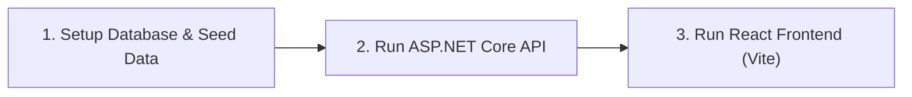

# KajBazar - Local Execution & Production Publishing Guide

This document provides complete, step-by-step instructions for running **KajBazar** locally in development, configuring environment variables, executing database migrations, and publishing the full stack (PostgreSQL, ASP.NET Core Web API, React Frontend) to production servers.

---

## 💻 1. Prerequisites & Required Tools

Before running or publishing the application, ensure the following runtimes and tools are installed:

| Component | Required Version | Download / Installation Link |
| :--- | :--- | :--- |
| **.NET SDK** | .NET 8.0 SDK (or runtime compatible) | [dotnet.microsoft.com](https://dotnet.microsoft.com/download/dotnet/8.0) |
| **Node.js runtime** | Node.js v18 LTS, v20 LTS, or v22 LTS | [nodejs.org](https://nodejs.org/) |
| **PostgreSQL Database** | PostgreSQL v15 or higher | [postgresql.org](https://www.postgresql.org/download/) |
| **Git Version Control** | Git 2.40+ | [git-scm.com](https://git-scm.com/) |
| **Code Editor / IDE** | VS Code or Visual Studio 2022 | [code.visualstudio.com](https://code.visualstudio.com/) |

---

## 🚀 2. Local Execution Guide ("How to Run")

Follow these steps sequentially to get the application running on your local machine.


```mermaid
flowchart LR
    StepA["1. Setup Database & Seed Data"] --> StepB["2. Run ASP.NET Core API"]
    StepB --> StepC["3. Run React Frontend (Vite)"]
```

### Step 2.1: PostgreSQL Database Setup

1. **Start PostgreSQL Service**:
   ```bash
   sudo systemctl start postgresql
   ```

2. **Create Database**:
   ```sql
   psql -U postgres -c "CREATE DATABASE kajbazar_db;"
   ```

3. **Run DDL Schema and Seed Scripts**:
   ```bash
   # Create database tables, constraints, triggers, and indexes
   psql -U postgres -d kajbazar_db -f sql/01_schema_ddl.sql

   # Populate roles, districts, upazilas, categories, and test users
   psql -U postgres -d kajbazar_db -f sql/02_seed_data.sql
   ```

---

### Step 2.2: Backend API Execution (ASP.NET Core .NET 8)

1. **Navigate to backend directory**:
   ```bash
   cd src/KajBazar.API
   ```

2. **Configure Environment Connection Settings (`appsettings.json`)**:
   ```json
   {
     "ConnectionStrings": {
       "DefaultConnection": "Host=localhost;Port=5432;Database=kajbazar_db;Username=postgres;Password=;"
     },
     "Jwt": {
       "Key": "KajBazarSuperSecretKeyForJwtAuthentication2026",
       "Issuer": "KajBazarAPI"
     }
   }
   ```

3. **Restore Packages & Run Web API**:
   ```bash
   dotnet restore
   dotnet build
   dotnet run
   ```

4. **Verify API Status**:
   - Web API: `http://localhost:5000`
   - Interactive Swagger UI: `http://localhost:5000/swagger`

---

### Step 2.3: Frontend Execution (React.js + Vite)

1. **Navigate to client directory**:
   ```bash
   cd client
   ```

2. **Install Node Dependencies**:
   ```bash
   npm install
   ```

3. **Start Development Server**:
   ```bash
   npm run dev
   ```

4. **Access Application**:
   Open browser and navigate to: `http://localhost:5173`

---

## 🌐 3. Production Publishing & Deployment Guide ("How to Publish")

### Step 3.1: Production PostgreSQL Database Setup

1. Provision a managed PostgreSQL instance or install PostgreSQL 15+ on Ubuntu Linux.
2. Apply DDL schema [`sql/01_schema_ddl.sql`](file:///home/noir/Desktop/PROJECTS/Kajbazar/sql/01_schema_ddl.sql) and seed data [`sql/02_seed_data.sql`](file:///home/noir/Desktop/PROJECTS/Kajbazar/sql/02_seed_data.sql).
3. Create a dedicated application user (`kajbazar_app`) with least privilege.

---

### Step 3.2: Production ASP.NET Core Publishing (Linux / Nginx)

1. **Compile Optimized Release Binaries**:
   ```bash
   dotnet publish src/KajBazar.API/KajBazar.API.csproj -c Release -o ./publish_api
   ```

2. **Deploy to Production Linux Server**:
   Transfer `./publish_api` folder contents to `/var/www/kajbazar/api`.

3. **Configure Systemd Service Unit (`/etc/systemd/system/kajbazar-api.service`)**:
   ```ini
   [Unit]
   Description=KajBazar Web API (.NET 8)
   After=network.target postgresql.service

   [Service]
   WorkingDirectory=/var/www/kajbazar/api
   ExecStart=/usr/bin/dotnet /var/www/kajbazar/api/KajBazar.API.dll
   Restart=always
   RestartSec=5
   KillSignal=SIGINT
   SyslogIdentifier=kajbazar-api
   User=deploy
   Environment=ASPNETCORE_ENVIRONMENT=Production
   Environment=ASPNETCORE_URLS=http://127.0.0.1:5000

   [Install]
   WantedBy=multi-user.target
   ```

   Enable and start service:
   ```bash
   sudo systemctl daemon-reload
   sudo systemctl enable --now kajbazar-api.service
   ```

---

### Step 3.3: Production React Frontend Publishing

1. **Compile Optimized Production Bundle**:
   ```bash
   cd client
   npm run build
   ```
2. Transfer `./client/dist` contents to `/var/www/kajbazar/client`.
3. Set file ownership: `sudo chown -R www-data:www-data /var/www/kajbazar/client`.

---

### Step 3.4: Production Nginx Reverse Proxy Configuration

In `/etc/nginx/sites-available/kajbazar.conf`:
```nginx
server {
    listen 80;
    server_name kajbazar.com www.kajbazar.com;

    root /var/www/kajbazar/client;
    index index.html;

    # React Router SPA fallback
    location / {
        try_files $uri $uri/ /index.html;
    }

    # API Reverse Proxy
    location /api/ {
        proxy_pass http://127.0.0.1:5000;
        proxy_http_version 1.1;
        proxy_set_header Upgrade $http_upgrade;
        proxy_set_header Connection keep-alive;
        proxy_set_header Host $host;
        proxy_cache_bypass $http_upgrade;
        proxy_set_header X-Forwarded-For $proxy_add_x_forwarded_for;
        proxy_set_header X-Forwarded-Proto $scheme;
    }
}
```

Enable site and test:
```bash
sudo ln -s /etc/nginx/sites-available/kajbazar.conf /etc/nginx/sites-enabled/
sudo nginx -t
sudo systemctl reload nginx
```

---

### Step 3.5: Free SSL Certificate via Certbot

```bash
sudo certbot --nginx -d kajbazar.com -d www.kajbazar.com
```
Certbot automatically installs trusted SSL certificates and configures automatic renewal.
