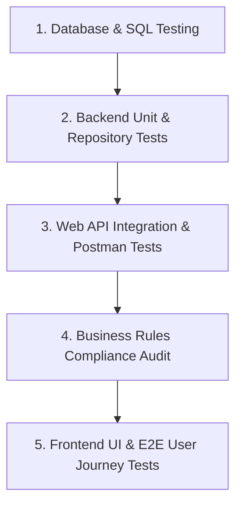

# KajBazar - Testing Procedure & Quality Assurance Guide

This document defines the comprehensive testing methodology, test suites, business rule verification matrices, and automated/manual testing procedures for **KajBazar: A Community-Driven Service Provider Directory Platform**.

---

## 🧪 1. Testing Strategy Overview



---

## 🗄️ 2. Database & SQL Query Testing

### 2.1 Schema DDL & Constraint Validation
Execute [`sql/01_schema_ddl.sql`](file:///home/noir/Desktop/4th/Project/sql/01_schema_ddl.sql) against a local PostgreSQL test instance and verify:
- All 12 tables (`users`, `roles`, `service_provider_profiles`, `categories`, `reviews`, etc.) are created without syntax errors.
- Primary key default UUID generation (`gen_random_uuid()`) functions correctly.
- Foreign Key cascading rules and unique constraints (`email`, `phone_number`, `uq_consumer_worker_review`) are strictly enforced.

```bash
# Execute DDL Script
psql -U postgres -d kajbazar_db -f sql/01_schema_ddl.sql
```

### 2.2 Seed Data Verification
Execute [`sql/02_seed_data.sql`](file:///home/noir/Desktop/4th/Project/sql/02_seed_data.sql) and verify record insertion:
- 3 Roles inserted (`Admin`, `Consumer`, `ServiceProvider`).
- Bangladesh Regional Data (`Patuakhali`, `Dhaka`, `Barishal` districts and `Dumki`, `Mirzaganj` upazilas).
- 5 Service Categories (`Electrician`, `Plumber`, `Carpenter`, `Mechanic`, `Painter`).
- 2 Verified Worker Profiles (`Karim Electrical`, `Rahim Plumbing`).

### 2.3 Operational & Complex Query Testing
Execute CRUD and Complex queries to ensure PostgreSQL execution plans use B-Tree indexes:
```bash
# Run Operational CRUD Tests
psql -U postgres -d kajbazar_db -f sql/03_crud_queries.sql

# Run Complex Search & Analytical Tests
psql -U postgres -d kajbazar_db -f sql/04_complex_queries.sql
```

---

## ⚙️ 3. Backend Web API Testing (.NET 8)

### 3.1 Unit Testing (xUnit + Moq)
Create unit tests in `tests/KajBazar.UnitTests`:
- **Auth Service Tests**: Verify password hashing using BCrypt and JWT Bearer token generation.
- **Repository Tests**: Verify repository query methods returning correct entity mappings.

```bash
# Command to run unit tests
dotnet test tests/KajBazar.UnitTests/KajBazar.UnitTests.csproj
```

### 3.2 Integration Testing (`WebApplicationFactory`)
Create integration tests in `tests/KajBazar.IntegrationTests`:
- Test Web API controllers against a test PostgreSQL database.

### 3.3 Postman / Swagger End-to-End API Test Collection

| Endpoint | HTTP Method | Payload / Params | Expected Status | Validation Criteria |
| :--- | :--- | :--- | :--- | :--- |
| `/api/auth/register` | `POST` | `{ "email": "user@test.com", "password": "Password123#", "role": "Consumer" }` | `200 OK` / `201 Created` | User ID returned, password hashed |
| `/api/auth/login` | `POST` | `{ "email": "user@test.com", "password": "Password123#" }` | `200 OK` | Valid JWT Bearer token string returned |
| `/api/workers/search` | `GET` | `?category=Electrician&districtId=1&upazilaId=1` | `200 OK` | Only `VERIFIED` worker profiles returned |
| `/api/reviews` | `POST` | `{ "workerProfileId": "...", "rating": 5, "comment": "Great!" }` | `200 OK` | Review saved; worker average rating updated |
| `/api/recommendations` | `POST` | `{ "workerName": "Jamal", "phone": "019...", "category": 1 }` | `200 OK` | Status set to `PENDING` for admin review |
| `/api/admin/workers/{id}/approve` | `PUT` | Header: `Authorization: Bearer <Admin_JWT>` | `200 OK` | Worker status changed to `VERIFIED` |

---

## 📋 4. Business Rules Compliance Audit Matrix

| Business Rule | Description | Test Case & Verification Procedure | Pass / Fail Criteria |
| :--- | :--- | :--- | :--- |
| **BR-01 / BR-13** | Authentication & RBAC | Attempt accessing `/api/admin/*` without an `Admin` JWT token. | Must return `401 Unauthorized` or `403 Forbidden`. |
| **BR-02 / BR-03** | Worker Profile & Public Directory | Search public worker directory as a consumer. | Only workers with `verification_status = 'VERIFIED'` must be displayed. |
| **BR-04** | Multi-Category Support | Register worker under both `Electrician` and `Plumber`. | `worker_categories` table must store multiple records for 1 profile ID. |
| **BR-05** | Location & Category Filter | Query workers in Patuakhali -> Dumki for `Electrician`. | Returned list must match specified location and category filters. |
| **BR-06** | Direct Contact | Click "Contact Worker" button on UI. | Worker phone number revealed directly (`tel:017...`) with no fees. |
| **BR-07 / BR-08** | Review Submission Constraints | Submit a 2nd review for the same worker using same consumer account. | DB constraint `uq_consumer_worker_review` must update existing review instead of duplicating. |
| **BR-09** | Offline Worker Recommendation | Submit referral for offline worker via `/api/recommendations`. | Referral stored in `community_recommendations` with status `PENDING`. |
| **BR-10** | Admin Verification Control | Admin invokes `/api/admin/workers/{id}/approve`. | Worker status updated to `VERIFIED` and logged in `admin_audit_logs`. |

---

## 💻 5. Frontend UI & E2E User Journey Testing

### 5.1 React Component Unit Tests (React Testing Library)
Run component unit tests:
```bash
cd client
npm test
```
- Verify `WorkerCard` renders worker attributes, average rating badge, and phone toggle.
- Verify `WorkerFilter` updates filter state on selection.

### 5.2 End-to-End User Flow (Cypress / Playwright)
Automate E2E testing for complete user flow:
1. Consumer logs into platform.
2. Navigates to `/directory`, searches for "Electrician" in "Patuakhali" / "Dumki".
3. Clicks "Contact Worker" to reveal phone number.
4. Submits review and star rating.
5. Navigates to `/recommend` and submits an offline worker referral.
6. Admin logs into `/admin` and approves pending offline worker referral.
