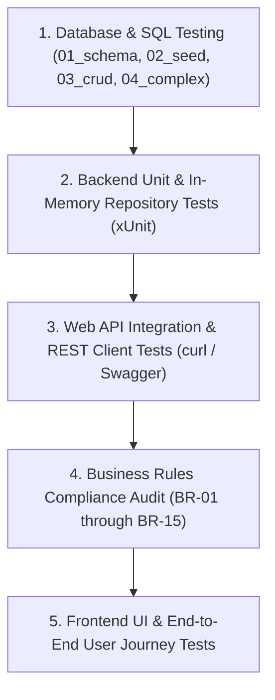

# KajBazar - Testing Procedure & Quality Assurance Guide

This document defines the comprehensive testing methodology, test suites, business rule verification matrices, and automated/manual testing procedures for **KajBazar: A Community-Driven Service Provider Directory Platform**.

---

## 🧪 1. Testing Strategy Overview


```mermaid
flowchart TD
    T1["1. Database & SQL Testing (01_schema, 02_seed, 03_crud, 04_complex)"] --> T2["2. Backend Unit & In-Memory Repository Tests (xUnit)"]
    T2 --> T3["3. Web API Integration & REST Client Tests (curl / Swagger)"]
    T3 --> T4["4. Business Rules Compliance Audit (BR-01 through BR-15)"]
    T4 --> T5["5. Frontend UI & End-to-End User Journey Tests"]
```

---

## 🗄️ 2. Database & SQL Query Testing

### 2.1 Schema DDL & Constraint Validation
Execute [`sql/01_schema_ddl.sql`](file:///home/noir/Desktop/PROJECTS/Kajbazar/sql/01_schema_ddl.sql) against a local PostgreSQL test instance and verify:
- All 12 tables (`users`, `roles`, `service_providers`, `categories`, `reviews`, etc.) are created without syntax errors.
- Primary key default UUID generation (`gen_random_uuid()`) functions correctly.
- Foreign Key cascading rules and unique constraints (`email`, `phone_number`, `uq_review_consumer_worker`) are strictly enforced.

```bash
psql -U postgres -d kajbazar_db -f sql/01_schema_ddl.sql
```

### 2.2 Seed Data Verification
Execute [`sql/02_seed_data.sql`](file:///home/noir/Desktop/PROJECTS/Kajbazar/sql/02_seed_data.sql) and verify record insertion:
- 3 Roles inserted (`Admin`, `Consumer`, `ServiceProvider`).
- Bangladesh Regional Data (`Patuakhali`, `Dhaka`, `Barishal`, `Khulna` districts and 9 upazilas).
- 7 Service Categories (`Electrician`, `Plumber`, `Appliance Technician`, `Carpenter`, `Painter`, `Mason`, `Mechanic`).
- Verified Worker Profiles with real BCrypt hashes and rating trigger recalculations.

```bash
psql -U postgres -d kajbazar_db -f sql/02_seed_data.sql
```

### 2.3 Operational & Complex Query Testing
Execute CRUD and Complex queries to ensure PostgreSQL execution plans use B-Tree indexes:
```bash
# Run Operational CRUD Tests
psql -U postgres -d kajbazar_db -f sql/03_crud_queries.sql

# Run Complex Search & Analytical Tests
psql -U postgres -d kajbazar_db -f sql/04_complex_queries.sql
```

---

## ⚙️ 3. Backend Automated Unit Tests (.NET 8 & xUnit)

All automated unit tests reside in [`tests/KajBazar.Tests/`](file:///home/noir/Desktop/PROJECTS/Kajbazar/tests/KajBazar.Tests).
Tests run using `Microsoft.EntityFrameworkCore.InMemory` for sub-second, isolated execution without external database dependencies.

### 3.1 Test Suites Catalog (14 Tests)

1. **`AuthTests.cs`**:
   - `RegisterNewUser_SuccessfullyHashesPasswordAndPersists`: Verifies user registration and BCrypt password encryption (`BR-01`, `BR-15`).
   - `Login_WithValidCredentials_ReturnsTokenAndUserDetails`: Verifies credential checking and JWT generation.
   - `Login_WithInvalidPassword_ThrowsUnauthorizedException`: Rejects invalid passwords with `UnauthorizedAccessException`.

2. **`WorkerSearchAndProfileTests.cs`**:
   - `SearchWorkers_ReturnsOnlyVerifiedWorkers`: Guarantees unverified/pending workers never appear in public search (`BR-03`).
   - `SearchWorkers_FilteredByCategory_ReturnsMatchingWorkers`: Verifies category filtering (`BR-04`, `BR-05`).
   - `SearchWorkers_FilteredByDistrictAndUpazila_ReturnsExactLocationMatches`: Verifies regional hierarchy filtering (`BR-05`).
   - `GetWorkerProfileById_ReturnsFullProfileAndCategories`: Tests full worker profile retrieval with trade tags (`BR-02`).

3. **`ReviewAndRatingTests.cs`**:
   - `SubmitReview_FirstTime_CreatesReviewAndRecalculatesWorkerRating`: Verifies review submission and rating recalculation (`BR-07`, `BR-08`).
   - `SubmitReview_SecondTimeBySameConsumer_UpdatesExistingReviewInsteadOfDuplicate`: Enforces single review per consumer-worker pair (`BR-08`).
   - `SubmitReview_WithMultipleConsumers_CalculatesAccurateAverageRating`: Mathematical average rating verification.

4. **`RecommendationTests.cs`**:
   - `CreateRecommendation_SuccessfullyPersistsWithPendingStatus`: Verifies community referrals for offline workers (`BR-09`).
   - `UpdateRecommendationStatus_ChangesStatusToContactedOrOnboarded`: Admin workflow verification.

5. **`AdminAuditLogTests.cs`**:
   - `LogAction_PersistsAuditTrailRecordWithJsonValues`: Verifies admin action auditing (`BR-14`).
   - `GetAuditLogs_ReturnsChronologicallyOrderedEvents`: Audit log retrieval in reverse chronological order.

### 3.2 Running Automated Tests via CLI

```bash
dotnet test KajBazar.sln
```

Expected Output:
```
Passed!  - Failed: 0, Passed: 14, Skipped: 0, Total: 14, Duration: ~300 ms
```

---

## 📋 4. Business Rules Compliance Audit Matrix

| Business Rule | Description | Verification Procedure | Pass / Fail Criteria |
| :--- | :--- | :--- | :--- |
| **`BR-01 / BR-13`** | Authentication & RBAC | Request `/api/admin/stats` with no token or consumer token. | Returns `401 Unauthorized` or `403 Forbidden`. |
| **`BR-02 / BR-03`** | Worker Profile & Public Directory | Search `/api/workers` for pending worker. | Only workers with `verification_status = 'VERIFIED'` appear. |
| **`BR-04`** | Multi-Category Support | Assign worker to multiple categories via `worker_categories`. | Multiple category rows saved for single worker UUID. |
| **`BR-05`** | Location & Category Filter | Query `/api/workers?categoryId=1&upazilaId=1`. | Returned list matches exact category and upazila. |
| **`BR-06`** | Direct Contact | Click "Contact Worker" button in UI. | Worker mobile number (`017...`) is revealed directly. |
| **`BR-07 / BR-08`** | Review Constraints | Submit two reviews from same consumer for same worker. | Existing review is updated; review count remains 1. |
| **`BR-09`** | Offline Worker Recommendation | Submit referral via `/api/recommendations`. | Saved with status `PENDING` in `recommendations` table. |
| **`BR-10 / BR-14`** | Admin Verification & Audit | Admin approves worker via `/api/admin/workers/{id}/verify`. | Worker status becomes `VERIFIED` and event is logged in `admin_audit_logs`. |
| **`BR-15`** | Data Encryption | Inspect `users.password_hash` column in database. | Stored as 60-character BCrypt hash starting with `$2a$11$`. |

---

## 💻 5. Frontend UI Verification & Build

```bash
cd client
npm run build
```
Confirms clean compilation of all JSX components, routes, and CSS bundles without syntax or packaging errors.
