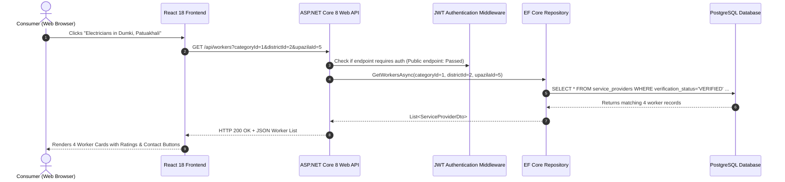

# Volume 01: Complete Architecture & Build From Scratch Guide
## A Beginner-Friendly, Step-by-Step Blueprint for Building KajBazar from Zero

---

## 📖 Welcome, Future Builder!

If you have never built a full-stack web application before, or if words like "3-tier architecture", "Entity Framework", "Dependency Injection", and "REST API" make you feel intimidated—**relax**. Take a deep breath. 

This document was written specifically to explain every single brick and mortar of **KajBazar** as if you are starting from absolute scratch on a brand-new, empty computer. We assume zero prior knowledge of enterprise software patterns. Every concept will be explained using real-world physical analogies before we look at terminal commands or code.

---

## 📑 Detailed Table of Contents

1. [The "Dumb Person" Mental Model: How Modern Web Systems Actually Work](#1-the-dumb-person-mental-model-how-modern-web-systems-actually-work)
   - 1.1 The Restaurant Analogy (Frontend, Backend, Database)
   - 1.2 What is a Client (Browser / React)?
   - 1.3 What is a Server (ASP.NET Core 8 Web API)?
   - 1.4 What is a Database (PostgreSQL)?
   - 1.5 What is HTTP and JSON (The Waiter's Notepad)?
   - 1.6 What is an Operating System Process and Port?
2. [High-Level Architecture of KajBazar](#2-high-level-architecture-of-kajbazar)
   - 2.1 The 3-Tier Layered Architecture
   - 2.2 Why We Divided the Backend into 3 C# Projects (Clean Architecture)
   - 2.3 Visual Request-Response Lifecycle Diagram
   - 2.4 Separation of Concerns: The Golden Rule of Software
3. [Prerequisites & Machine Setup](#3-prerequisites--machine-setup)
   - 3.1 Operating System & Hardware Requirements
   - 3.2 Installing Git (Step-by-Step for Ubuntu/Linux, macOS, and Windows)
   - 3.3 Installing .NET 8 SDK (Step-by-Step and PATH Verification)
   - 3.4 Installing Node.js & npm (Using NVM for Version Isolation)
   - 3.5 Installing PostgreSQL 15+ (Setting Up Passwords and Service)
   - 3.6 Installing Postman / curl / VS Code Extensions
4. [Step-by-Step Construction from an Empty Directory](#4-step-by-step-construction-from-an-empty-directory)
   - 4.1 Step 1: Initialize the Git Repository and Project Folder
   - 4.2 Step 2: Create the .NET Solution and 4 Projects
   - 4.3 Step 3: Wire Up Project References (Inter-Project Dependencies)
   - 4.4 Step 4: Install Required NuGet Packages
   - 4.5 Step 5: Initialize the Frontend Application with Vite & React
   - 4.6 Step 6: Install Frontend npm Packages
   - 4.7 Step 7: Create the Database SQL Scripts Directory
5. [Deep Dive into the Solution Files and `.csproj` XML](#5-deep-dive-into-the-solution-files-and-csproj-xml)
   - 5.1 Understanding `KajBazar.sln`
   - 5.2 Anatomy of `KajBazar.Core.csproj`
   - 5.3 Anatomy of `KajBazar.Infrastructure.csproj`
   - 5.4 Anatomy of `KajBazar.API.csproj`
   - 5.5 Anatomy of `KajBazar.Tests.csproj`
   - 5.6 Anatomy of `client/package.json`
6. [Deep Dive into the Folder Structure](#6-deep-dive-into-the-folder-structure)
   - 6.1 Root Directory Walkthrough
   - 6.2 Backend Folder Anatomy (`src/`)
   - 6.3 Frontend Folder Anatomy (`client/`)
   - 6.4 Database Folder Anatomy (`sql/`)
   - 6.5 Test Folder Anatomy (`tests/`)
   - 6.6 Documentation & Diagrams Anatomy (`docs/`)
7. [The Data Flow: From User Click to Disk and Back](#7-the-data-flow-from-user-click-to-disk-and-back)
   - 7.1 Step 1: User Types in the Browser
   - 7.2 Step 2: React Component Captures Event
   - 7.3 Step 3: Axios Prepares and Sends HTTP Request
   - 7.4 Step 4: Network Cable & Kestrel Web Server
   - 7.5 Step 5: ASP.NET Core Middleware Pipeline
   - 7.6 Step 6: Controller Receives DTO & Validates
   - 7.7 Step 7: Repository Executes EF Core LINQ Query
   - 7.8 Step 8: Npgsql Driver Translates to Raw SQL
   - 7.9 Step 9: PostgreSQL Reads Tables & Executes Trigger
   - 7.10 Step 10: The Response Returns to the User
8. [Running the Entire Platform Locally](#8-running-the-entire-platform-locally)
   - 8.1 Database Initialization
   - 8.2 Running Backend API
   - 8.3 Running Frontend Vite Server
   - 8.4 Verifying Full-Stack Integration
9. [Common Beginner Pitfalls When Building from Scratch](#9-common-beginner-pitfalls-when-building-from-scratch)
   - 9.1 Circular Dependencies Between Projects
   - 9.2 Port Collisions (Port 5000 or 5173 Already in Use)
   - 9.3 Case Sensitivity in PostgreSQL vs C#
   - 9.4 Forgetting `await` in Async Methods
10. [Conclusion & Next Steps](#10-conclusion--next-steps)

---

## 1. The "Dumb Person" Mental Model: How Modern Web Systems Actually Work

### 1.1 The Restaurant Analogy (Frontend, Backend, Database)

Imagine you walk into a nice restaurant in Patuakhali called **"The KajBazar Cafe"**.

```
+---------------------------------------------------------------------------------+
|                              THE RESTAURANT ANALOGY                              |
|                                                                                 |
|   [ Customer at Table ]        [ The Waiter ]             [ The Kitchen Cook ]  |
|         (FRONTEND)                (BACKEND)                   (DATABASE)        |
|                                                                                 |
|  Look at printed menu.  --->  Takes order note.   --->  Walks to walk-in fridge |
|  Decide on grilled fish.      Checks if allowed.        Pulls raw fish & spices |
|  Smiles and taps table.       Validates order rules.    Cooks & arranges plate  |
|                                                                                 |
|  Sees steaming hot plate <--- Delivers plated fish <--- Handed dish from kitchen|
|  Eats and is satisfied.       Hands over bill.          Updates pantry ledger   |
+---------------------------------------------------------------------------------+
```

Let's map each part to software:
1. **The Dining Table (Frontend / User Interface)**:
   - This is what the customer actually sees, touches, and clicks. The nice tablecloth, the menu cards, the buttons. In KajBazar, this is the **React.js Single Page Application** running in Google Chrome or Mozilla Firefox on your computer or smartphone.
2. **The Waiter (Backend Web API / ASP.NET Core 8)**:
   - The customer never enters the kitchen! That would be chaotic and dangerous. Instead, the customer tells the waiter: *"Please bring me a list of verified electricians in Dumki"*.
   - The waiter checks the rules: *"Is this customer logged in? Is the request polite and valid?"*. If yes, the waiter walks into the kitchen, gets the information, formats it nicely, and carries it back to the table. In KajBazar, this is our **C# ASP.NET Core 8 Web API**.
3. **The Kitchen Pantry & Refrigerator (Database / PostgreSQL)**:
   - This is where the raw ingredients are safely locked away in organized shelves and cold rooms. Nobody from the public can touch the shelves. Only authorized kitchen staff (the backend) can open the door with their secret key. In KajBazar, this is our **PostgreSQL Relational Database**.

### 1.2 What is a Client (Browser / React)?
A "Client" is any program that runs on your personal device (laptop, phone, tablet). 
When you visit `http://localhost:5173`, your browser downloads HTML, JavaScript, and CSS files. The JavaScript runs inside your browser. It renders buttons, text boxes, and search cards. It reacts instantly when you type.

### 1.3 What is a Server (ASP.NET Core 8 Web API)?
A "Server" is a computer program running in the background, listening 24 hours a day for messages arriving over the internet or network. It doesn't have a screen or pretty buttons. It only cares about raw data. It receives questions like:
- *"Does a user with email `rahim@example.com` and password `Secret123` exist?"*
It answers in fractions of a second:
- *"Yes! Here is a secure digital passport (JWT token) proving who they are."*

### 1.4 What is a Database (PostgreSQL)?
A database is specialized software designed to write data onto physical computer hard drives and retrieve it in milliseconds, even if millions of rows exist. Unlike a simple text file or Excel spreadsheet, a relational database (RDBMS) like PostgreSQL guarantees **ACID properties**:
- **Atomicity**: If an operation has 3 steps (e.g., deducting balance, creating invoice, updating status) and step 2 fails, steps 1 and 3 are automatically rolled back. No corrupt half-finished data!
- **Consistency**: All rules (foreign keys, check constraints, unique emails) are strictly enforced by the database engine itself.
- **Isolation**: Hundreds of users can search and review workers at the exact same millisecond without colliding.
- **Durability**: Once PostgreSQL says "Saved", that data will survive even if the computer's power cord is ripped out of the wall.

### 1.5 What is HTTP and JSON (The Waiter's Notepad)?
- **HTTP (Hypertext Transfer Protocol)**: The standard set of grammar and rules computers use to talk over the internet.
  - `GET`: "Please give me information." (e.g. `GET /api/workers`)
  - `POST`: "Please create something new." (e.g. `POST /api/auth/register`)
  - `PUT`: "Please replace or update existing information." (e.g. `PUT /api/reviews/{id}`)
  - `DELETE`: "Please delete this item." (e.g. `DELETE /api/workers/{id}`)
- **JSON (JavaScript Object Notation)**: The universal text language used to exchange data. It looks like human-readable key-value pairs:
```json
{
  "fullName": "Md. Rafiqul Islam",
  "trade": "Electrician",
  "hourlyRate": 350.00,
  "isVerified": true
}
```

### 1.6 What is an Operating System Process and Port?
When an application runs on a computer:
- A **Process** is a running instance of a program in RAM. For example, `dotnet` running our backend is one process with a unique Process ID (PID like `12450`).
- A **Port** is like an apartment door number on your computer. Your computer has 65,535 ports:
  - Port `80`: Standard HTTP web traffic.
  - Port `443`: Secure HTTPS encrypted traffic.
  - Port `5000`: Where our ASP.NET Core Web API listens.
  - Port `5173`: Where our Vite React frontend development server listens.
  - Port `5432`: Where PostgreSQL listens for database queries.

---

## 2. High-Level Architecture of KajBazar

### 2.1 The 3-Tier Layered Architecture

KajBazar follows the industry-standard **Three-Tier Architecture**:

```
+=============================================================================+
|                        TIER 1: PRESENTATION LAYER                           |
|                      (client/ - React 18 SPA + Vite)                        |
|                                                                             |
|  - Pages: HomePage, WorkerDirectoryPage, WorkerProfilePage, AdminDashboard   |
|  - Components: WorkerCard, WorkerFilter, StarRating, Navigation, Modals    |
|  - State: AuthContext (Stores Current User, Role, JWT in localStorage)      |
|  - HTTP Services: Axios API client with automatic Bearer Token headers      |
+======================================+======================================+
                                       |
                           JSON over HTTPS (Port 5000)
                                       |
+======================================v======================================+
|                        TIER 2: APPLICATION & LOGIC                          |
|                       (src/ - ASP.NET Core 8 Web API)                       |
|                                                                             |
|  +-----------------------------------------------------------------------+  |
|  | KajBazar.API (Presentation Layer of Backend)                          |  |
|  | - Controllers: AuthController, WorkersController, ReviewsController    |  |
|  | - Middleware: ExceptionHandlingMiddleware, Authentication/CORS       |  |
|  +-----------------------------------+-----------------------------------+  |
|                                      |                                      |
|  +-----------------------------------v-----------------------------------+  |
|  | KajBazar.Core (Domain Core - Zero External Dependencies)              |  |
|  | - Entities: User, ServiceProviderProfile, Review, Recommendation      |  |
|  | - DTOs: AuthDtos, WorkerDtos, ReviewDtos, AdminDtos, GeographyDtos    |  |
|  | - Interfaces: IUserRepository, IServiceProviderRepository, etc.       |  |
|  +-----------------------------------+-----------------------------------+  |
|                                      |                                      |
|  +-----------------------------------v-----------------------------------+  |
|  | KajBazar.Infrastructure (Implementation & Data Access)                |  |
|  | - KajBazarDbContext (EF Core Npgsql Mapping)                          |  |
|  | - Repositories: EF Core implementations of Core Interfaces            |  |
|  | - Services: AuthService (BCrypt Hashing + JWT Generation)             |  |
|  +-----------------------------------------------------------------------+  |
+======================================+======================================+
                                       |
                             Npgsql TCP (Port 5432)
                                       |
+======================================v======================================+
|                          TIER 3: DATA STORAGE                               |
|                         (PostgreSQL 15+ Database)                           |
|                                                                             |
|  - 12 Tables (users, service_providers, reviews, recommendations, etc.)    |
|  - Check Constraints, Foreign Keys with ON DELETE CASCADE / RESTRICT        |
|  - Triggers: update_worker_rating_stats() recalculates averages on reviews  |
|  - B-Tree Indexes: Fast lookup by category, location, and rating            |
+=============================================================================+
```

### 2.2 Why We Divided the Backend into 3 C# Projects (Clean Architecture)

In traditional, poorly-written software, developers dump all their code into a single folder. The database queries are mixed with web page buttons, and password hashing is mixed with HTML templates. When something breaks, everything breaks!

In KajBazar, we use **Clean Architecture** by creating three separate C# projects:

1. **`KajBazar.Core` (The Brain)**:
   - This project contains our **Domain Models** (`User`, `ServiceProviderProfile`, `Review`) and **Interfaces** (`IUserRepository`, `IServiceProviderRepository`).
   - **Crucial Rule**: `KajBazar.Core` has **ZERO** dependencies on databases, HTTP, or external frameworks. It is 100% pure C#. If we decide to swap PostgreSQL for MongoDB or Oracle tomorrow, `KajBazar.Core` never has to change!
2. **`KajBazar.Infrastructure` (The Muscle)**:
   - This project knows how to talk to PostgreSQL. It uses **Entity Framework Core 8** and **Npgsql**.
   - It implements the interfaces defined in `KajBazar.Core`. For example, `KajBazar.Core` says *"I need an `IUserRepository` that can find a user by email"*. `KajBazar.Infrastructure` provides `UserRepository.cs`, which writes the actual SQL query to find that user in PostgreSQL.
3. **`KajBazar.API` (The Voice)**:
   - This is the web-facing part of the backend. It receives incoming HTTP requests from the internet, checks security tokens, calls the appropriate repository, and converts the output into clean JSON.

---

### 2.3 Visual Request-Response Lifecycle Diagram



---

## 3. Prerequisites & Machine Setup

Before building or running the project, you need the following standard development tools installed on your operating system (Linux, macOS, or Windows 11 with WSL2).

### 3.1 Operating System & Hardware Requirements
- **OS**: Linux (Ubuntu 20.04+, Debian 11+, Arch, Fedora), macOS Monterey+, or Windows 10/11 (WSL2 recommended).
- **RAM**: Minimum 4 GB (8 GB+ recommended).
- **Disk Space**: At least 2 GB free disk space.

### 3.2 Installing Git
Git tracks every line of code history. Check if installed:
```bash
git --version
```
If not installed:
- **Ubuntu/Debian**: `sudo apt update && sudo apt install -y git`
- **macOS**: `brew install git`
- **Windows**: Download from [git-scm.com](https://git-scm.com).

### 3.3 Installing .NET 8 SDK
KajBazar is built on .NET 8 LTS (Long Term Support). Check if installed:
```bash
dotnet --version
```
If it is not installed or shows version 7 or older, install .NET 8 SDK:
- **Linux (Official Script Method)**:
  ```bash
  curl -sSL https://dot.net/v1/dotnet-install.sh | bash -s -- --channel 8.0
  echo 'export DOTNET_ROOT=$HOME/.dotnet' >> ~/.bashrc
  echo 'export PATH=$PATH:$HOME/.dotnet' >> ~/.bashrc
  source ~/.bashrc
  dotnet --version
  # Should print: 8.0.xxx
  ```
- **Ubuntu Package**: `sudo apt install -y dotnet-sdk-8.0`
- **macOS**: `brew install dotnet-sdk`
- **Windows**: Download the .NET 8 SDK installer from [dotnet.microsoft.com](https://dotnet.microsoft.com/download/dotnet/8.0).

### 3.4 Installing Node.js & npm
Node.js runs our JavaScript development tools, and npm installs frontend packages.
```bash
node --version
npm --version
```
Requirements: Node.js version `18.x`, `20.x`, or `22.x`.
If not installed:
- **Linux / macOS (via NVM)**:
  ```bash
  curl -o- https://raw.githubusercontent.com/nvm-sh/nvm/v0.39.7/install.sh | bash
  source ~/.bashrc
  nvm install 20
  nvm use 20
  ```
- **Windows**: Download Node.js LTS installer from [nodejs.org](https://nodejs.org).

### 3.5 Installing PostgreSQL 15+
PostgreSQL stores all users, worker profiles, reviews, and logs.
```bash
psql --version
```
If not installed:
- **Ubuntu/Debian**:
  ```bash
  sudo apt update
  sudo apt install -y postgresql postgresql-contrib
  sudo systemctl enable postgresql
  sudo systemctl start postgresql
  ```
- **macOS**: `brew install postgresql@15 && brew services start postgresql@15`
- **Windows**: Download installer from [postgresql.org](https://www.postgresql.org/download/windows/).

### 3.6 Installing Postman / curl / VS Code
- **VS Code**: The recommended code editor with the "C# Dev Kit" and "ES7+ React/Redux" extensions.
- **curl**: Command-line HTTP tool built into all modern operating systems.

---

## 4. Step-by-Step Construction from an Empty Directory

If you had to recreate this entire repository from a blank terminal on an empty machine, here are the exact commands you would run.

### 4.1 Step 1: Initialize the Git Repository and Project Folder
```bash
mkdir Kajbazar
cd Kajbazar
git init
```

Create a root `.gitignore` file so we don't accidentally commit build artifacts, passwords, or dependencies:
```bash
cat << 'EOF' > .gitignore
# .NET build output
bin/
obj/
*.user
*.suo

# Node dependencies and build output
node_modules/
dist/
.vite/

# Environment and secrets
.env
appsettings.Development.json
*.local

# OS files
.DS_Store
Thumbs.db
EOF
```

### 4.2 Step 2: Create the .NET Solution and 4 Projects
A .NET Solution (`.sln`) is a master container that ties multiple projects together.

```bash
# 1. Create the master solution file
dotnet new sln -n KajBazar

# 2. Create the Core Class Library
dotnet new classlib -n KajBazar.Core -o src/KajBazar.Core -f net8.0

# 3. Create the Infrastructure Class Library
dotnet new classlib -n KajBazar.Infrastructure -o src/KajBazar.Infrastructure -f net8.0

# 4. Create the Web API project
dotnet new webapi -n KajBazar.API -o src/KajBazar.API -f net8.0

# 5. Create the xUnit Test project
dotnet new xunit -n KajBazar.Tests -o tests/KajBazar.Tests -f net8.0

# 6. Add all 4 projects to the master solution
dotnet sln KajBazar.sln add src/KajBazar.Core/KajBazar.Core.csproj
dotnet sln KajBazar.sln add src/KajBazar.Infrastructure/KajBazar.Infrastructure.csproj
dotnet sln KajBazar.sln add src/KajBazar.API/KajBazar.API.csproj
dotnet sln KajBazar.sln add tests/KajBazar.Tests/KajBazar.Tests.csproj
```

### 4.3 Step 3: Wire Up Project References (Inter-Project Dependencies)
In Clean Architecture, dependencies point inward:
- `KajBazar.Infrastructure` depends on `KajBazar.Core`.
- `KajBazar.API` depends on `KajBazar.Infrastructure` and `KajBazar.Core`.
- `KajBazar.Tests` depends on `KajBazar.Core`, `KajBazar.Infrastructure`, and `KajBazar.API`.

```bash
# Infrastructure references Core
dotnet add src/KajBazar.Infrastructure/KajBazar.Infrastructure.csproj reference src/KajBazar.Core/KajBazar.Core.csproj

# API references Core and Infrastructure
dotnet add src/KajBazar.API/KajBazar.API.csproj reference src/KajBazar.Core/KajBazar.Core.csproj
dotnet add src/KajBazar.API/KajBazar.API.csproj reference src/KajBazar.Infrastructure/KajBazar.Infrastructure.csproj

# Tests reference all three
dotnet add tests/KajBazar.Tests/KajBazar.Tests.csproj reference src/KajBazar.Core/KajBazar.Core.csproj
dotnet add tests/KajBazar.Tests/KajBazar.Tests.csproj reference src/KajBazar.Infrastructure/KajBazar.Infrastructure.csproj
dotnet add tests/KajBazar.Tests/KajBazar.Tests.csproj reference src/KajBazar.API/KajBazar.API.csproj
```

### 4.4 Step 4: Install Required NuGet Packages
NuGet is the official package manager for .NET (like npm for JavaScript).

```bash
# Core packages (BCrypt for password hashing)
dotnet add src/KajBazar.Core/KajBazar.Core.csproj package BCrypt.Net-Next --version 4.0.3

# Infrastructure packages (EF Core, Npgsql PostgreSQL, Naming Conventions, JWT Tokens)
dotnet add src/KajBazar.Infrastructure/KajBazar.Infrastructure.csproj package Npgsql.EntityFrameworkCore.PostgreSQL --version 8.0.2
dotnet add src/KajBazar.Infrastructure/KajBazar.Infrastructure.csproj package EFCore.NamingConventions --version 8.0.3
dotnet add src/KajBazar.Infrastructure/KajBazar.Infrastructure.csproj package Microsoft.EntityFrameworkCore.Design --version 8.0.2
dotnet add src/KajBazar.Infrastructure/KajBazar.Infrastructure.csproj package System.IdentityModel.Tokens.Jwt --version 8.0.2

# API packages (Authentication Bearer, Swagger)
dotnet add src/KajBazar.API/KajBazar.API.csproj package Microsoft.AspNetCore.Authentication.JwtBearer --version 8.0.2
dotnet add src/KajBazar.API/KajBazar.API.csproj package Swashbuckle.AspNetCore --version 6.5.0

# Test packages (In-Memory EF Core database for testing without PostgreSQL)
dotnet add tests/KajBazar.Tests/KajBazar.Tests.csproj package Microsoft.EntityFrameworkCore.InMemory --version 8.0.2
```

### 4.5 Step 5: Initialize the Frontend Application with Vite & React
Vite is the modern, blisteringly fast frontend build tool.
```bash
# Create client folder with React template
npm create vite@latest client -- --template react

# Move into client folder
cd client
```

### 4.6 Step 6: Install Frontend npm Packages
```bash
# Install routing, HTTP client, and icon/styling utilities
npm install react-router-dom axios

# Verify everything builds cleanly
npm run build
cd ..
```

### 4.7 Step 7: Create the Database SQL Scripts Directory
```bash
mkdir -p sql
# In this directory, we store our 4 numbered SQL scripts:
# 01_schema_ddl.sql       (Tables, indexes, triggers)
# 02_seed_data.sql        (Districts, categories, verified test workers)
# 03_crud_queries.sql     (CRUD testing statements)
# 04_complex_queries.sql  (Analytical queries)
```

---

## 5. Deep Dive into the Solution Files and `.csproj` XML

Let's look under the hood at the exact XML configuration files generated by .NET.

### 5.1 Understanding `KajBazar.sln`
The `.sln` file is a plain text configuration used by Visual Studio and the `dotnet` CLI to track which projects belong to the solution:
```
Microsoft Visual Studio Solution File, Format Version 12.00
Project("{FAE04EC0-301F-11D3-BF4B-00C04F79EFBC}") = "KajBazar.Core", "src/KajBazar.Core/KajBazar.Core.csproj", "{GUID1}"
EndProject
Project("{FAE04EC0-301F-11D3-BF4B-00C04F79EFBC}") = "KajBazar.Infrastructure", "src/KajBazar.Infrastructure/KajBazar.Infrastructure.csproj", "{GUID2}"
EndProject
Project("{FAE04EC0-301F-11D3-BF4B-00C04F79EFBC}") = "KajBazar.API", "src/KajBazar.API/KajBazar.API.csproj", "{GUID3}"
EndProject
Project("{FAE04EC0-301F-11D3-BF4B-00C04F79EFBC}") = "KajBazar.Tests", "tests/KajBazar.Tests/KajBazar.Tests.csproj", "{GUID4}"
EndProject
```

### 5.2 Anatomy of `KajBazar.Core.csproj`
```xml
<Project Sdk="Microsoft.NET.Sdk">
  <PropertyGroup>
    <TargetFramework>net8.0</TargetFramework>
    <ImplicitUsings>enable</ImplicitUsings>
    <Nullable>enable</Nullable>
  </PropertyGroup>

  <ItemGroup>
    <PackageReference Include="BCrypt.Net-Next" Version="4.0.3" />
  </ItemGroup>
</Project>
```
- `<TargetFramework>net8.0</TargetFramework>`: Tells the compiler to target the .NET 8 LTS runtime.
- `<Nullable>enable</Nullable>`: Turns on C# 8+ Nullable Reference Types. The compiler warns you if an object could be `null`, preventing the famous "NullReferenceException" crash!
- `<ImplicitUsings>enable</ImplicitUsings>`: Automatically imports standard namespaces like `System`, `System.Collections.Generic`, `System.Threading.Tasks` so you don't have to write 20 `using` statements at the top of every file.

### 5.3 Anatomy of `KajBazar.Infrastructure.csproj`
```xml
<Project Sdk="Microsoft.NET.Sdk">
  <PropertyGroup>
    <TargetFramework>net8.0</TargetFramework>
    <ImplicitUsings>enable</ImplicitUsings>
    <Nullable>enable</Nullable>
  </PropertyGroup>

  <ItemGroup>
    <ProjectReference Include="..\KajBazar.Core\KajBazar.Core.csproj" />
  </ItemGroup>

  <ItemGroup>
    <PackageReference Include="EFCore.NamingConventions" Version="8.0.3" />
    <PackageReference Include="Microsoft.EntityFrameworkCore.Design" Version="8.0.2">
      <IncludeAssets>runtime; build; native; contentfiles; analyzers; buildtransitive</IncludeAssets>
      <PrivateAssets>all</PrivateAssets>
    </PackageReference>
    <PackageReference Include="Npgsql.EntityFrameworkCore.PostgreSQL" Version="8.0.2" />
    <PackageReference Include="System.IdentityModel.Tokens.Jwt" Version="8.0.2" />
  </ItemGroup>
</Project>
```

### 5.4 Anatomy of `KajBazar.API.csproj`
```xml
<Project Sdk="Microsoft.NET.Sdk.Web">
  <PropertyGroup>
    <TargetFramework>net8.0</TargetFramework>
    <Nullable>enable</Nullable>
    <ImplicitUsings>enable</ImplicitUsings>
  </PropertyGroup>

  <ItemGroup>
    <ProjectReference Include="..\KajBazar.Core\KajBazar.Core.csproj" />
    <ProjectReference Include="..\KajBazar.Infrastructure\KajBazar.Infrastructure.csproj" />
  </ItemGroup>

  <ItemGroup>
    <PackageReference Include="Microsoft.AspNetCore.Authentication.JwtBearer" Version="8.0.2" />
    <PackageReference Include="Swashbuckle.AspNetCore" Version="6.5.0" />
  </ItemGroup>
</Project>
```
Notice `Sdk="Microsoft.NET.Sdk.Web"`. This tells .NET that this project is a web server and automatically includes Kestrel, routing, JSON serializers, and ASP.NET Core middleware.

---

## 6. Deep Dive into the Folder Structure

Here is the complete project directory structure:

```
Kajbazar/
├── KajBazar.sln                  # Master .NET Solution file
├── prompt.md                     # Project requirements & mission prompt
├── README.md                     # High-level overview & quickstart
├── client/                       # React 18 Frontend Single Page Application
│   ├── index.html                # HTML entry point with viewport & title
│   ├── package.json              # Frontend scripts & dependencies
│   ├── vite.config.js            # Vite build & development server config
│   └── src/
│       ├── App.jsx               # Route definitions & layout wrappers
│       ├── index.jsx             # React DOM root render mount
│       ├── components/           # Reusable UI widgets
│       │   ├── Navigation.jsx    # Top navigation bar with role-based links
│       │   └── WorkerComponents.jsx # WorkerCard, WorkerFilter, DetailModal
│       ├── context/
│       │   └── AuthContext.jsx   # Global session state (user, token, role)
│       ├── pages/
│       │   ├── HomePage.jsx      # Landing page, stats, quick category grid
│       │   ├── WorkerDirectoryPage.jsx # Multi-filter worker search directory
│       │   ├── WorkerProfilePage.jsx   # Worker details, reviews, contact
│       │   ├── RecommendWorkerPage.jsx # Offline worker nomination form
│       │   └── AuthAndAdminPages.jsx   # Login, Register, Admin Dashboard
│       ├── services/
│       │   └── api.js            # Axios client with JWT interceptor
│       └── styles/
│           └── App.css           # Responsive modern CSS design system
├── src/                          # Backend ASP.NET Core 8 Web API
│   ├── KajBazar.Core/            # Domain Entities, DTOs, and Interfaces
│   │   ├── DTOs/                 # Data Transfer Objects
│   │   │   ├── AdminDtos.cs
│   │   │   ├── AuthDtos.cs
│   │   │   ├── GeographyDtos.cs
│   │   │   ├── RecommendationDtos.cs
│   │   │   ├── ReviewDtos.cs
│   │   │   └── WorkerDtos.cs
│   │   ├── Entities/             # C# Database Models
│   │   │   ├── User.cs
│   │   │   ├── ServiceProviderProfile.cs
│   │   │   ├── Review.cs
│   │   │   ├── Recommendation.cs
│   │   │   └── AdminAuditLog.cs
│   │   └── Interfaces/           # Repository Contracts
│   │       └── RepositoryInterfaces.cs
│   ├── KajBazar.Infrastructure/  # EF Core DbContext, Repositories, AuthService
│   │   ├── Data/
│   │   │   └── KajBazarDbContext.cs
│   │   ├── Repositories/
│   │   │   ├── UserRepository.cs
│   │   │   ├── ServiceProviderRepository.cs
│   │   │   ├── ReviewRepository.cs
│   │   │   ├── RecommendationRepository.cs
│   │   │   ├── GeographyRepository.cs
│   │   │   ├── CategoryRepository.cs
│   │   │   └── AdminAuditLogRepository.cs
│   │   └── Services/
│   │       └── AuthService.cs
│   └── KajBazar.API/             # Controllers, Middleware, Configuration
│       ├── Program.cs            # App startup, DI configuration, Swagger
│       ├── appsettings.json      # Connection strings & JWT secrets
│       ├── Controllers/
│       │   ├── AdminController.cs
│       │   ├── AuthController.cs
│       │   ├── CategoriesController.cs
│       │   ├── GeographyController.cs
│       │   ├── RecommendationsController.cs
│       │   ├── ReviewsController.cs
│       │   └── WorkersController.cs
│       └── Middleware/
│           └── ExceptionHandlingMiddleware.cs
├── sql/                          # Production-hardened PostgreSQL Scripts
│   ├── 01_schema_ddl.sql         # 12 Tables, constraints, triggers, indexes
│   ├── 02_seed_data.sql          # Sample districts, categories, verified workers
│   ├── 03_crud_queries.sql       # Tested CRUD verification queries
│   └── 04_complex_queries.sql    # Analytical reporting queries
├── tests/                        # Automated xUnit Test Project
│   └── KajBazar.Tests/
│       ├── AdminAuditLogTests.cs
│       ├── AuthTests.cs
│       ├── RecommendationTests.cs
│       ├── ReviewAndRatingTests.cs
│       └── WorkerSearchAndProfileTests.cs
└── docs/                         # Diagrams and Developer Documentation
    ├── diagrams/                 # 15 Mermaid diagrams (.mmd)
    └── development-guide/        # 10 comprehensive volumes
```

---

## 7. The Data Flow: From User Click to Disk and Back

Let's walk through an exact, step-by-step trace of what happens inside the computer when a user clicks the **"Search Electricians"** button.

```
[User Browser]
      │  (1) Clicks "Filter: Electrician, Dumki"
      ▼
[React: WorkerDirectoryPage.jsx]
      │  (2) Calls fetchWorkers({ categoryId: 1, upazilaId: 5 })
      ▼
[Axios: api.js]
      │  (3) Formats GET http://localhost:5000/api/workers?categoryId=1&upazilaId=5
      ▼
[Operating System TCP/IP Stack]
      │  (4) Sends TCP packets to Port 5000
      ▼
[Kestrel Web Server]
      │  (5) Unpacks HTTP request header and query string
      ▼
[ASP.NET Core Middleware Pipeline]
      │  (6) Runs ExceptionHandlingMiddleware
      │  (7) Runs CORS Policy: Verifies Origin http://localhost:5173 is allowed
      │  (8) Runs Authentication/Authorization: Confirms route is public [AllowAnonymous]
      ▼
[Routing Engine]
      │  (9) Maps request to WorkersController.GetWorkers()
      ▼
[WorkersController.cs]
      │  (10) Calls _workerRepo.SearchWorkersAsync(filter)
      ▼
[ServiceProviderRepository.cs]
      │  (11) Builds EF Core LINQ query:
      │       context.ServiceProviders
      │         .Where(w => w.VerificationStatus == "VERIFIED")
      │         .Where(w => w.UpazilaId == 5)
      │         .Where(w => w.WorkerCategories.Any(c => c.CategoryId == 1))
      ▼
[Npgsql EF Core Provider]
      │  (12) Translates LINQ into optimized PostgreSQL SQL:
      │       SELECT sp.*, u.full_name, u.phone_number, up.name, d.name
      │       FROM service_providers sp
      │       JOIN users u ON sp.user_id = u.id
      │       JOIN worker_categories wc ON sp.id = wc.worker_id
      │       WHERE sp.verification_status = 'VERIFIED'
      │         AND sp.upazila_id = 5 AND wc.category_id = 1;
      ▼
[PostgreSQL 15 Database Server]
      │  (13) Query Planner hits B-tree index idx_workers_upazila_status
      │  (14) Reads 4 rows from disk/shared buffers in 0.8ms
      ▼
[Data Travels Back Up]
      │  (15) Npgsql parses PostgreSQL binary wire protocol into C# Objects
      │  (16) Repository projects into List<WorkerSummaryDto>
      │  (17) Controller wraps in Ok(workers) (HTTP 200)
      │  (18) System.Text.Json serializes to UTF-8 JSON payload
      │  (19) Kestrel sends HTTP 200 response packets back over TCP
      │  (20) Axios receives JSON array and resolves Promise
      │  (21) WorkerDirectoryPage calls setWorkers(data)
      │  (22) React reconciles Virtual DOM and updates screen
      ▼
[User Screen Displays 4 Verified Electrician Cards!]
```

---

## 8. Running the Entire Platform Locally

Follow these 4 simple steps to run the complete platform on your computer right now:

### 8.1 Database Initialization
Make sure PostgreSQL is running on `localhost:5432`:
```bash
# 1. Create database
psql -U postgres -c "CREATE DATABASE kajbazar_db;"

# 2. Run schema DDL (creates all 12 tables, indexes, triggers)
psql -U postgres -d kajbazar_db -f sql/01_schema_ddl.sql

# 3. Seed initial data (categories, districts, upazilas, test users, verified workers)
psql -U postgres -d kajbazar_db -f sql/02_seed_data.sql
```

### 8.2 Running Backend API
Open a terminal window:
```bash
cd src/KajBazar.API
dotnet run
```
You will see:
```
info: Microsoft.Hosting.Lifetime[14]
      Now listening on: http://localhost:5000
info: Microsoft.Hosting.Lifetime[0]
      Application started. Press Ctrl+C to shut down.
```
*Tip: You can open your browser to `http://localhost:5000/swagger` to see the interactive API explorer!*

### 8.3 Running Frontend Vite Server
Open a second terminal window:
```bash
cd client
npm install   # Only needed on first run
npm run dev
```
You will see:
```
  VITE v5.4.14  ready in 210 ms

  ➜  Local:   http://localhost:5173/
  ➜  Network: use --host to expose
```

### 8.4 Verifying Full-Stack Integration
1. Open your web browser to `http://localhost:5173`.
2. You will see the **KajBazar** homepage with live statistics:
   - "Verified Service Providers"
   - "Districts & Upazilas Covered"
   - "Community Customer Reviews"
3. Click **"Find a Service Provider"** in the top navigation bar.
4. Select **District: Patuakhali**, **Upazila: Dumki**, and **Category: Electrician**.
5. You will see verified workers appear. Click **"Call Worker"** to instantly reveal their phone number (`01711-223344`).

---

## 9. Common Beginner Pitfalls When Building from Scratch

### 9.1 Circular Dependencies Between Projects
In C#, Project A cannot reference Project B if Project B references Project A. 
If you try to add a reference from `KajBazar.Core` to `KajBazar.Infrastructure`, the build will fail with a circular dependency error. Keep `KajBazar.Core` completely independent!

### 9.2 Port Collisions
If you see `Failed to bind to address http://127.0.0.1:5000: address already in use`, it means another process is still running. Run `sudo lsof -i :5000` to find the process ID and terminate it with `kill -9 <PID>`.

### 9.3 Case Sensitivity in PostgreSQL vs C#
PostgreSQL converts unquoted table and column names to lowercase. C# uses PascalCase. If you don't configure `.UseSnakeCaseNamingConvention()` in EF Core, queries will fail with `relation "ServiceProviders" does not exist`.

### 9.4 Forgetting `await` in Async Methods
If you call `_context.Users.ToListAsync()` without `await`, C# returns a `Task<List<User>>` object instead of the actual list of users. Always remember to `await` every asynchronous database operation!

---

## 10. Conclusion & Next Steps

You now understand the complete high-level design, component boundaries, and directory structure of KajBazar!

To dive deeper into the database schema, relational constraints, and security triggers, proceed to:
👉 **[Volume 02: Database Guide & Production Hardening](02-database-guide-and-production-hardening.md)**
