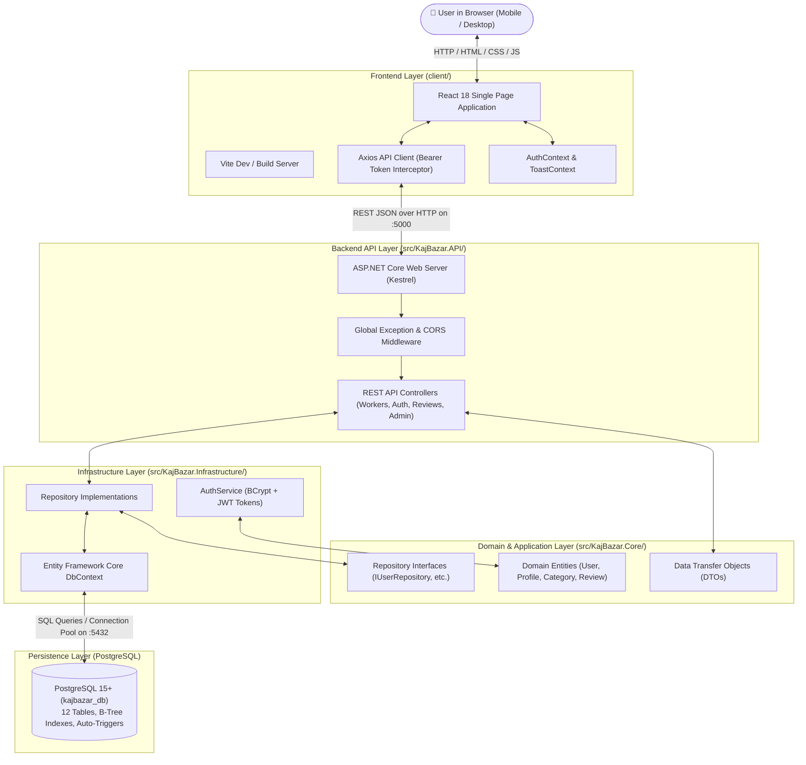

# 🛠️ KajBazar Developer Guide & Learning Roadmap
## The Beginner's Companion to Building a Full-Stack Community Service Directory from the Ground Up

---

## 🌟 Welcome, Future Full-Stack Engineer!

If you are reading this guide, you are about to embark on a journey from knowing basic programming concepts to understanding and building a complete, production-ready, full-stack enterprise web application: **KajBazar**.

This guide is designed as if a **Senior Software Architect is sitting right beside you**, explaining:
- **What** each technology does in plain English.
- **Why** we chose this specific tool or pattern instead of alternatives.
- **How** data flows from a user's finger tapping a button in their browser, through network protocols, into the backend web server, and down to magnetic/solid-state storage in a relational database.
- **Step-by-step instructions** to construct, test, debug, and run the entire platform.

---

## 📑 Guide Volumes Index

The master development manual is organized into 11 progressive, modular volumes:

| Volume | Title | Focus & Core Topics |
| :---: | :--- | :--- |
| [**Volume 00**](00-master-overview-and-table-of-contents.md) | **Master Overview & System Map** | Plain-English problem statement, real-world community impact, learning tracks, and architectural dictionary. |
| [**Volume 01**](01-complete-architecture-and-build-from-scratch.md) | **Architecture & Build from Scratch** | Mental models (the Restaurant Analogy), 3-tier Clean Architecture, creating the .NET solution, projects, references, and Vite frontend from zero. |
| [**Volume 02**](02-database-guide-and-production-hardening.md) | **Database Guide & Production Hardening** | Relational database first principles, all 12 PostgreSQL tables, keys, composite indexes, automated triggers, and seed scripts. |
| [**Volume 03**](03-backend-aspnet-core-developer-guide.md) | **Backend ASP.NET Core Developer Guide** | Web API anatomy, C# async/await, Entity Framework Core, Repositories, Services, DTOs, controllers, and middleware. |
| [**Volume 04**](04-frontend-react-developer-guide.md) | **Frontend React.js & Vite Developer Guide** | React 18, Vite build pipeline, atomic design system (`Button`, `Badge`, `Card`, `Modal`, `Input`), Context API, Axios interceptors, and responsive UI. |
| [**Volume 05**](05-testing-guide-and-test-suites.md) | **Testing Guide & Test Suites** | Automated testing manual: xUnit, Moq, InMemory database test suites, auditing business rules, and verifying correctness. |
| [**Volume 06**](06-deployment-and-devops-guide.md) | **Deployment & DevOps Guide** | Production hosting on Linux, Kestrel systemd daemon, Nginx reverse proxy, SSL with Certbot, health checks, and containerization. |
| [**Volume 07**](07-troubleshooting-and-faq-guide.md) | **Troubleshooting & FAQ Guide** | 45+ real-world bugs, port collisions, CORS misconfigurations, JWT token expiration, PostgreSQL connection fixes, and solutions. |
| [**Volume 08**](08-maintenance-and-evolution-guide.md) | **Maintenance & Evolution Guide** | Zero-downtime database evolution, package upgrades, adding new trade categories, SMS verification roadmap, and real-time chat architecture. |
| [**Volume 09**](09-security-and-incident-response-guide.md) | **Security & Incident Response Guide** | OWASP Top 10 defenses, BCrypt password hashing, JWT security, SQL injection prevention, CORS hardening, and incident response runbooks. |
| [**Volume 10**](10-performance-optimization-and-scaling-guide.md) | **Performance Optimization & Scaling** | Database query profiling with `EXPLAIN ANALYZE`, N+1 prevention, connection pooling, Redis caching, and bundle minification. |

---

## 🎯 1. What is KajBazar?

### The Real-World Problem
Imagine you are at home in **Dumki, Patuakhali**, or **Dhanmondi, Dhaka**, and suddenly a water pipe bursts under your kitchen sink, or your room's ceiling fan wiring sparks and stops working. 

What do most people do today?
1. They walk out into the neighborhood bazaar asking shopkeepers: *"Do you know a trustworthy electrician or plumber?"*
2. Or they phone three different relatives asking: *"Can you give me the number of the technician who fixed your water pump last month?"*

This informal system has serious problems:
- **For Consumers**: Finding a skilled, reliable worker in your local neighborhood (Upazila) is frustrating, slow, and uncertain. You don't know if the person is skilled, what their expected rate is, or whether previous customers were satisfied.
- **For Skilled Workers**: Hardworking local tradespeople (electricians, mechanics, carpenters, plumbers, painters, masons) struggle to find consistent clients because they rely solely on local word-of-mouth. They don't have websites, marketing budgets, or digital presence.
- **For Commercial Gig Apps**: Traditional ride-sharing or service apps act as strict middlemen. They take a heavy commission (15%–30%) from the worker's earnings, penalize them with arbitrary platform rules, and charge booking fees to consumers.

### How KajBazar Solves This
**KajBazar** is a community-driven digital service directory platform designed specifically for Bangladesh:
1. **Direct Phone Contact**: When a consumer finds a worker, they click to reveal the worker's verified mobile phone number. They call directly. No booking fees, no platform commissions, and zero middlemen.
2. **Admin-Verified Credentials**: Service providers register their trade skills, experience, and location. Platform administrators verify their credentials before they appear in public search.
3. **Geographic Hierarchy**: Search filters cascade naturally by **District** (e.g. Patuakhali) and **Upazila** (e.g. Dumki), ensuring you find workers who can actually arrive at your doorstep.
4. **Community Referrals for Offline Workers**: Many of the most experienced traditional craftsmen in rural and semi-urban Bangladesh do not own smartphones or know how to create online profiles. KajBazar allows any registered consumer to recommend an offline worker by providing their name and phone number. Platform admins then contact and onboard them into the directory.
5. **Authentic Ratings & Reviews**: Consumers leave honest star ratings and written reviews after work is completed, creating transparent community reputation.

---

## 🏗️ 2. The Complete System Architecture

To understand how KajBazar works, look at this simplified end-to-end journey:



### The Request Lifecycle: Searching for an Electrician
Here is what happens under the hood when a user visits `/directory?category=Electrician`:
1. **Browser**: The user selects "Electrician" in the React UI.
2. **State & URL**: The `WorkerDirectoryPage` component updates the URL parameters and invokes `searchWorkersApi({ category: 'Electrician' })`.
3. **HTTP Client**: Axios sends an HTTP `GET` request to `http://localhost:5000/api/workers/search?category=Electrician`.
4. **Web Server**: ASP.NET Core receives the request on port 5000. `ExceptionHandlingMiddleware` ensures any errors will be caught safely.
5. **Controller**: `WorkersController.SearchWorkers` receives the query parameters bound into a `WorkerSearchFilterDto`.
6. **Repository**: The controller calls `_workerRepository.SearchWorkersAsync(...)`.
7. **ORM (EF Core)**: Entity Framework Core translates the C# LINQ query into an optimized SQL `SELECT` statement:
   ```sql
   SELECT p.profile_id, u.full_name, u.phone_number, p.hourly_rate, p.average_rating ...
   FROM service_provider_profiles p
   JOIN users u ON p.user_id = u.user_id
   JOIN worker_categories wc ON p.profile_id = wc.profile_id
   JOIN categories c ON wc.category_id = c.category_id
   WHERE p.verification_status = 'VERIFIED' AND c.category_name = 'Electrician';
   ```
8. **PostgreSQL**: PostgreSQL uses its composite index `idx_sp_verification_search` to find matching records in milliseconds and returns the rows.
9. **Serialization**: EF Core maps the rows into C# entities. The controller maps them to `WorkerSummaryDto` objects and returns `HTTP 200 OK` with JSON.
10. **Render**: React receives the JSON response, turns off the skeleton loader, and renders polished `WorkerCard` components on screen.

---

## 🛠️ 3. Technology Stack & Why We Chose It

Every technology in KajBazar was chosen for a specific architectural and real-world reason:

| Technology | Layer | Why KajBazar Uses It |
| :--- | :--- | :--- |
| **C# / .NET (10 / 8 LTS)** | Backend Platform | Enterprise reliability, cross-platform performance, strong type safety, built-in dependency injection, and high throughput. |
| **ASP.NET Core Web API** | Web Server / API | High-performance asynchronous HTTP pipeline, built-in model validation, and rich middleware ecosystem. |
| **Entity Framework Core** | ORM (Data Access) | Eliminates repetitive SQL string boilerplate, provides strongly-typed LINQ queries, and manages automated migrations. |
| **PostgreSQL 15+** | Database | Rock-solid ACID compliance, native UUID generation, advanced constraints, and stored trigger functions. |
| **React 18** | Frontend Library | Component-based declarative UI, virtual DOM diffing, and widespread industry adoption. |
| **Vite** | Frontend Tooling | Lightning-fast development server with instant Hot Module Replacement (HMR) and optimized Rollup production bundling. |
| **React Router v6** | Client Routing | Declarative Single Page Application (SPA) routing with URL query parameter synchronization. |
| **Axios** | HTTP Client | Automatic JSON parsing, request/response interceptors (attaching JWT Bearer tokens), and global error handling. |
| **Lucide React** | Icons | Crisp, modern, lightweight SVG icons without bulky icon fonts. |
| **BCrypt.Net** | Password Security | Adaptive, salted cryptographic password hashing (cost factor 11) resistant to brute-force attacks. |
| **JWT (JSON Web Tokens)** | Auth Protocol | Stateless, cryptographically signed bearer tokens that scale horizontally without server-side session stores. |
| **xUnit & Moq** | Automated Testing | Industry standard unit and integration testing framework for .NET. |

---

## 🗺️ 4. Master Learning Roadmap for Beginners

Follow this step-by-step roadmap to master or build KajBazar:

```text
Phase 0: Prerequisites & Environment Setup
 ├── Install .NET SDK, Node.js, and PostgreSQL
 └── Verify CLI tools (dotnet, node, npm, psql)

Phase 1: Project Setup & Architecture Foundations
 ├── Create the master .NET solution and 3 projects (Core, Infrastructure, API)
 ├── Wire up inter-project dependencies (Core -> Infrastructure -> API)
 └── Initialize the Vite React frontend client

Phase 2: Database Schema & Relational Modeling
 ├── Create PostgreSQL database kajbazar_db
 ├── Run 01_schema_ddl.sql (12 tables, foreign keys, constraints, indexes)
 ├── Inspect triggers (auto-timestamp, auto-rating recalculation)
 └── Seed initial data with 02_seed_data.sql

Phase 3: Backend Foundation & Entity Framework Core
 ├── Define Domain Entities (User, Role, ServiceProviderProfile, Review, etc.)
 ├── Configure KajBazarDbContext with snake_case naming
 ├── Implement Repositories (UserRepository, ServiceProviderRepository, etc.)
 └── Register services in Program.cs using Dependency Injection

Phase 4: Authentication, Authorization & Security
 ├── Password hashing with BCrypt
 ├── JWT Bearer token generation and claims
 ├── Role-Based Access Control (Admin, Consumer, ServiceProvider)
 └── Secure protected controller endpoints

Phase 5: Core API Endpoints
 ├── Search & Filtering endpoint (/api/workers/search)
 ├── Profile management endpoints (/api/workers/me, /api/workers/profile)
 ├── Reviews & Ratings endpoints (/api/reviews)
 ├── Community Recommendations endpoints (/api/recommendations)
 ├── Admin Moderation endpoints (/api/admin/...)
 └── Health check endpoint (/health)

Phase 6: Frontend Design System & Atomic Components
 ├── Design tokens & global CSS (App.css)
 ├── Common UI component library (Button, Badge, Card, Modal, Input, RatingStars)
 ├── Skeleton loaders & empty states
 └── Toast notification system (ToastContext)

Phase 7: Frontend Page Construction
 ├── Header navbar & mobile sliding drawer
 ├── HomePage with hero search and featured verified workers
 ├── WorkerDirectoryPage with cascading filters and pagination
 ├── WorkerProfilePage (dual-mode: public worker view & worker dashboard)
 ├── RecommendWorkerPage for offline worker referrals
 └── AdminDashboardPage with metrics, moderation tabs, and ConfirmDialog

Phase 8: Frontend ↔ Backend Integration & Testing
 ├── Axios API client with automatic token attachment
 ├── Run automated xUnit test suite (14 passing tests)
 ├── Test end-to-end user flows (Register -> Search -> Call -> Review -> Admin Approve)
 └── Prepare for production deployment
```

---

## 🚀 5. Quick Verification: Running the Platform Locally

To immediately test your local installation, follow these verified steps:

### 1. Verify PostgreSQL Database
Make sure PostgreSQL is running and the database is populated:
```bash
# Check if PostgreSQL is listening on port 5432:
pg_isready

# If database is not created yet:
psql -U postgres -c "CREATE DATABASE kajbazar_db;"
psql -U postgres -d kajbazar_db -f sql/01_schema_ddl.sql
psql -U postgres -d kajbazar_db -f sql/02_seed_data.sql
```

### 2. Start Backend API Server (.NET)
```bash
cd /home/noir/Desktop/PROJECTS/Kajbazar/src/KajBazar.API
dotnet run --urls "http://localhost:5000"
```
- **Backend API**: `http://localhost:5000`
- **Swagger Documentation**: `http://localhost:5000/swagger`
- **Health Check**: `http://localhost:5000/health` (returns `Healthy`)

### 3. Start Frontend Client (React + Vite)
In a new terminal window:
```bash
cd /home/noir/Desktop/PROJECTS/Kajbazar/client
npm install
npm run dev
```
- **Frontend Application**: `http://localhost:3000`

### 4. Test Accounts
Log in at `http://localhost:3000/login` using the 1-click quick-fill buttons:
- **Admin**: `admin@kajbazar.com` / `Password123#`
- **Consumer**: `leon@gmail.com` / `Password123#`
- **Worker**: `karim@gmail.com` / `Password123#`

---

## 📖 Ready to Begin?
Head over to [**Volume 01: Complete Architecture & Build from Scratch**](01-complete-architecture-and-build-from-scratch.md) to start building KajBazar from the ground up!
