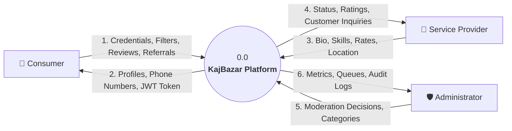

# KajBazar - Architectural & UML Diagrams Index

This directory contains the complete collection of formal software engineering diagrams for **KajBazar: A Community-Driven Service Provider Directory Platform**, designed in compliance with the System Analysis and Design specification (CIT-222).

---

## 📑 Diagrams Inventory

| # | Diagram Name | File | Description |
| :- | :--- | :--- | :--- |
| **01** | **Context Diagram (Level 0)** | [`01_context_diagram.mmd`](file:///home/noir/Desktop/PROJECTS/Kajbazar/docs/diagrams/01_context_diagram.mmd) | Boundary context showing external actors (Consumer, Worker, Admin) and primary data flows |
| **02** | **DFD Level 0** | [`02_dfd_level_0.mmd`](file:///home/noir/Desktop/PROJECTS/Kajbazar/docs/diagrams/02_dfd_level_0.mmd) | High-level system process interacting with all 6 central data stores |
| **03** | **DFD Level 1** | [`03_dfd_level_1.mmd`](file:///home/noir/Desktop/PROJECTS/Kajbazar/docs/diagrams/03_dfd_level_1.mmd) | Subsystem decomposition into Processes 1.0 to 5.0 and data flows to tables |
| **04** | **DFD Level 2** | [`04_dfd_level_2.mmd`](file:///home/noir/Desktop/PROJECTS/Kajbazar/docs/diagrams/04_dfd_level_2.mmd) | Detailed functional decomposition of Directory Search and Direct Contact |
| **05** | **Use Case Diagram** | [`05_use_case_diagram.mmd`](file:///home/noir/Desktop/PROJECTS/Kajbazar/docs/diagrams/05_use_case_diagram.mmd) | UML Use Cases for Guest, Consumer, Service Provider, and Administrator |
| **06** | **Activity Diagram - Registration** | [`06_activity_diagram_registration.mmd`](file:///home/noir/Desktop/PROJECTS/Kajbazar/docs/diagrams/06_activity_diagram_registration.mmd) | Activity flow for account registration, input validation, BCrypt hashing, and JWT issue |
| **07** | **Activity Diagram - Verification** | [`07_activity_diagram_worker_verification.mmd`](file:///home/noir/Desktop/PROJECTS/Kajbazar/docs/diagrams/07_activity_diagram_worker_verification.mmd) | Activity flow for worker profile submission and administrator verification (`BR-03`, `BR-10`) |
| **08** | **Activity Diagram - Search & Contact** | [`08_activity_diagram_search_and_contact.mmd`](file:///home/noir/Desktop/PROJECTS/Kajbazar/docs/diagrams/08_activity_diagram_search_and_contact.mmd) | Multi-criteria search, location filtering, and direct phone contact reveal (`BR-05`, `BR-06`) |
| **09** | **Activity Diagram - Reviews** | [`09_activity_diagram_review_submission.mmd`](file:///home/noir/Desktop/PROJECTS/Kajbazar/docs/diagrams/09_activity_diagram_review_submission.mmd) | Review submission, single review constraint check, and automatic aggregate update (`BR-08`) |
| **10** | **Activity Diagram - Recommendations** | [`10_activity_diagram_recommendation.mmd`](file:///home/noir/Desktop/PROJECTS/Kajbazar/docs/diagrams/10_activity_diagram_recommendation.mmd) | Offline skilled worker referral and administrative moderation workflow (`BR-09`) |
| **11** | **Class Diagram - Domain Model** | [`11_class_diagram_domain_model.mmd`](file:///home/noir/Desktop/PROJECTS/Kajbazar/docs/diagrams/11_class_diagram_domain_model.mmd) | Object-oriented domain entities, properties, enums, and navigation associations |
| **12** | **Class Diagram - Architecture** | [`12_class_diagram_architecture.mmd`](file:///home/noir/Desktop/PROJECTS/Kajbazar/docs/diagrams/12_class_diagram_architecture.mmd) | ASP.NET Core controllers, service interfaces, repository implementations, and DbContext |
| **13** | **Conceptual ER Diagram** | [`13_er_diagram_conceptual.mmd`](file:///home/noir/Desktop/PROJECTS/Kajbazar/docs/diagrams/13_er_diagram_conceptual.mmd) | High-level business entities and semantic relationships |
| **14** | **Physical ER Diagram** | [`14_er_diagram_physical.mmd`](file:///home/noir/Desktop/PROJECTS/Kajbazar/docs/diagrams/14_er_diagram_physical.mmd) | Complete relational schema with 12 PostgreSQL tables, types, PKs, FKs, and constraints |
| **15** | **Sequence Diagrams** | [`15_sequence_diagrams.mmd`](file:///home/noir/Desktop/PROJECTS/Kajbazar/docs/diagrams/15_sequence_diagrams.mmd) | Interaction sequence diagrams for search, review posting, and admin verification |

---

## 1. Context Diagram (Level 0 DFD)



---

## 2. Conceptual Architecture

```
+-------------------------------------------------------------+
|                      React.js SPA (Vite)                    |
|  - Navigation, WorkerDirectory, ProfilePage, AdminDashboard |
+-------------------------------------------------------------+
                              |
                     HTTPS / JSON REST API
                              |
+-------------------------------------------------------------+
|                 ASP.NET Core 8 Web API                      |
|  - Controllers: Auth, Workers, Reviews, Recommendations,    |
|                 Admin, Geography, Categories                |
|  - Middleware: ExceptionHandling, JWT Bearer Authentication |
+-------------------------------------------------------------+
                              |
+-------------------------------------------------------------+
|               Entity Framework Core 8 (Npgsql)              |
|  - Repositories: User, ServiceProvider, Review, Recommendation|
|  - Snake Case Naming Conventions & Value Converters         |
+-------------------------------------------------------------+
                              |
+-------------------------------------------------------------+
|               PostgreSQL 15+ Relational Database             |
|  - 12 Tables, B-Tree Indexes, Audit Logs, Rating Triggers   |
+-------------------------------------------------------------+
```
