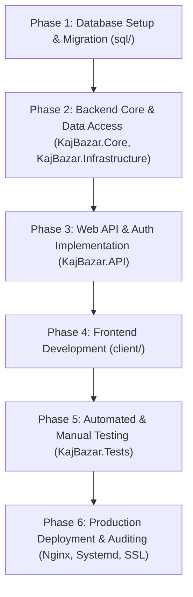

# KajBazar - Development Walkthrough & Task Roadmap

This walkthrough provides a step-by-step, ordered guide for developing, configuring, testing, and deploying **KajBazar: A Community-Driven Service Provider Directory Platform**.

---

## 📋 Task Execution Roadmap


```mermaid
flowchart TD
    A["Phase 1: Database Setup & Migration (sql/)"] --> B["Phase 2: Backend Core & Data Access (KajBazar.Core, KajBazar.Infrastructure)"]
    B --> C["Phase 3: Web API & Auth Implementation (KajBazar.API)"]
    C --> D["Phase 4: Frontend Development (client/)"]
    D --> E["Phase 5: Automated & Manual Testing (KajBazar.Tests)"]
    E --> F["Phase 6: Production Deployment & Auditing (Nginx, Systemd, SSL)"]
```

---

## Phase 1: Database Environment Setup

1. **Install PostgreSQL Server (v15+)**
   - Configure database instance and service settings.
   - Create database: `CREATE DATABASE kajbazar_db;`

2. **Execute Database Scripts**
   - Run DDL Script: Run [`sql/01_schema_ddl.sql`](file:///home/noir/Desktop/PROJECTS/Kajbazar/sql/01_schema_ddl.sql) to create tables, constraints, indexes, and triggers.
   - Run Seed Data: Run [`sql/02_seed_data.sql`](file:///home/noir/Desktop/PROJECTS/Kajbazar/sql/02_seed_data.sql) to seed default roles, districts, upazilas, categories, and test accounts.

3. **Verify Database Setup**
   - Execute standard CRUD test queries in [`sql/03_crud_queries.sql`](file:///home/noir/Desktop/PROJECTS/Kajbazar/sql/03_crud_queries.sql).
   - Test complex queries in [`sql/04_complex_queries.sql`](file:///home/noir/Desktop/PROJECTS/Kajbazar/sql/04_complex_queries.sql).

---

## Phase 2: ASP.NET Core Backend Setup

1. **Initialize Project Solution**
   - Create solution and 4 projects:
     ```bash
     dotnet new sln -n KajBazar
     dotnet new classlib -o src/KajBazar.Core
     dotnet new classlib -o src/KajBazar.Infrastructure
     dotnet new webapi -o src/KajBazar.API
     dotnet new xunit -o tests/KajBazar.Tests
     dotnet sln add src/KajBazar.Core/KajBazar.Core.csproj
     dotnet sln add src/KajBazar.Infrastructure/KajBazar.Infrastructure.csproj
     dotnet sln add src/KajBazar.API/KajBazar.API.csproj
     dotnet sln add tests/KajBazar.Tests/KajBazar.Tests.csproj
     ```

2. **Add NuGet Dependencies**
   - `Npgsql.EntityFrameworkCore.PostgreSQL`
   - `EFCore.NamingConventions`
   - `Microsoft.AspNetCore.Authentication.JwtBearer`
   - `BCrypt.Net-Next`
   - `Microsoft.EntityFrameworkCore.InMemory`

3. **Configure Entity Framework Core**
   - Map domain classes in [`src/KajBazar.Core/Entities/`](file:///home/noir/Desktop/PROJECTS/Kajbazar/src/KajBazar.Core/Entities/) to EF Core DbContext ([`src/KajBazar.Infrastructure/Data/KajBazarDbContext.cs`](file:///home/noir/Desktop/PROJECTS/Kajbazar/src/KajBazar.Infrastructure/Data/KajBazarDbContext.cs)).
   - Configure connection string in `appsettings.json`.

---

## Phase 3: Web API Controllers & Service Layer

1. **Authentication & JWT Service**
   - Implement `AuthService` handling password hashing (BCrypt) and JWT token generation.
   - Implement [`src/KajBazar.API/Controllers/AuthController.cs`](file:///home/noir/Desktop/PROJECTS/Kajbazar/src/KajBazar.API/Controllers/AuthController.cs) for Registration (`/api/auth/register`) and Login (`/api/auth/login`).

2. **Worker Directory & Profile Module**
   - Implement worker profile completion, category mapping, and verification submission.
   - Implement [`src/KajBazar.API/Controllers/WorkersController.cs`](file:///home/noir/Desktop/PROJECTS/Kajbazar/src/KajBazar.API/Controllers/WorkersController.cs) for public directory search with category & district/upazila filters.

3. **Reviews & Direct Contact Module**
   - Implement review posting (`BR-07`, `BR-08`) with 1-to-5 star ratings and feedback.
   - Implement [`src/KajBazar.API/Controllers/ReviewsController.cs`](file:///home/noir/Desktop/PROJECTS/Kajbazar/src/KajBazar.API/Controllers/ReviewsController.cs).

4. **Community Recommendation Module**
   - Implement user submission of offline skilled workers (`BR-09`).
   - Implement [`src/KajBazar.API/Controllers/RecommendationsController.cs`](file:///home/noir/Desktop/PROJECTS/Kajbazar/src/KajBazar.API/Controllers/RecommendationsController.cs).

5. **Admin Dashboard Module**
   - Implement worker profile approval/rejection (`BR-03`, `BR-10`).
   - Implement category management (`BR-11`) and audit logging (`BR-14`).
   - Implement [`src/KajBazar.API/Controllers/AdminController.cs`](file:///home/noir/Desktop/PROJECTS/Kajbazar/src/KajBazar.API/Controllers/AdminController.cs).

---

## Phase 4: Frontend Development (React.js + Vite)

1. **Client Application Setup**
   - Initialize React SPA in `client/` with Vite.
   - Setup Axios instance with JWT interceptor in [`client/src/services/api.js`](file:///home/noir/Desktop/PROJECTS/Kajbazar/client/src/services/api.js).

2. **Pages & Navigation Flow**
   - Build Landing & Worker Directory page with filtering controls (`Category`, `District`, `Upazila`).
   - Build Worker Profile detail modal / view with phone number reveal and review list (`BR-06`).
   - Build Consumer Login / Register UI.
   - Build Offline Worker Recommendation page (`BR-09`).
   - Build Admin Dashboard for worker verification and community recommendation moderation (`BR-10`).

---

## Phase 5: Verification & Testing

1. Run automated test suite:
   ```bash
   dotnet test KajBazar.sln
   ```
2. Run frontend build verification:
   ```bash
   cd client && npm run build
   ```

---

## Phase 6: Production Deployment

1. Publish API release bundle: `dotnet publish src/KajBazar.API/KajBazar.API.csproj -c Release -o /var/www/kajbazar/api`
2. Deploy systemd service `kajbazar-api.service`.
3. Configure Nginx reverse proxy with SSL certificate via Certbot.
